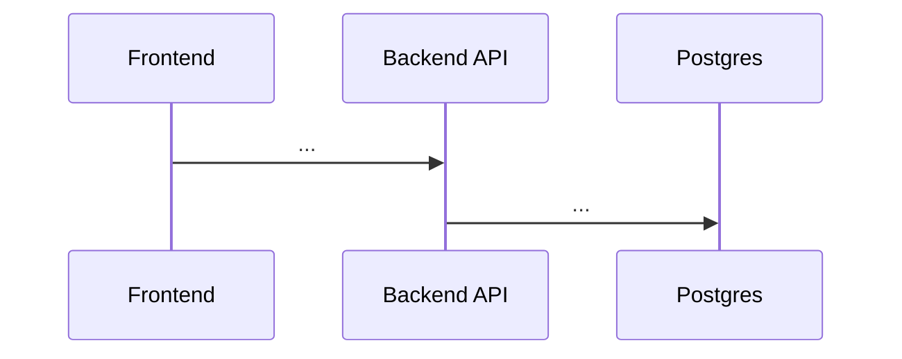

# <Feature name>

> Copy this file to `docs/technical/features/<feature>.md` (same name as the code folder) and fill every section. Delete these quote lines. A section that doesn't apply says "None" rather than being removed.

**Status:** Planned | In progress | Done  
**Code:** `backend/app/features/<feature>/` · `frontend/src/features/<feature>/`  
**Last updated:** YYYY-MM-DD

## What it is

Two or three sentences in plain language: what this feature does and why the product needs it. A newcomer should understand it without reading code.

## How it works

The main flow, step by step, from the user's action to the result. Add a Mermaid diagram when the flow branches, loops or crosses services.

## Code map

| File | Responsibility |
| --- | --- |
| `backend/app/features/<feature>/router.py` | |
| `backend/app/features/<feature>/service.py` | |
| `backend/app/features/<feature>/repository.py` | |
| `frontend/src/features/<feature>/components/...` | |

## API

| Method | Path | Purpose | Auth |
| --- | --- | --- | --- |
| | | | |

Request and response shapes live in `schemas.py`; list only what isn't obvious from them.

## Data model

Tables this feature owns, their key columns and relationships. Mention indexes and row-level security policies.

| Table | Key columns | Notes |
| --- | --- | --- |
| | | |

## Events

| Event | Published or consumed | When |
| --- | --- | --- |
| | | |

## Dependencies

- **Other features used (through their service or interface):**
- **Interfaces this feature defines, and their implementations:**
- **External services** (Supabase, E2B, LiteLLM, GitHub, ...):
- **Environment variables / config:**

## Design decisions

Why it's built this way, and the alternatives we rejected. One bullet per decision, with the date.

- YYYY-MM-DD — Decision — why.

## How to run and test

Commands to run it locally and run its tests, and any test data or fakes needed.

## Known limitations and gotchas

Edge cases, things that break easily, and planned improvements.

## Troubleshooting

| Symptom | Likely cause | Fix |
| --- | --- | --- |
| | | |

## Changelog

| Date | Change |
| --- | --- |
| YYYY-MM-DD | Created |
