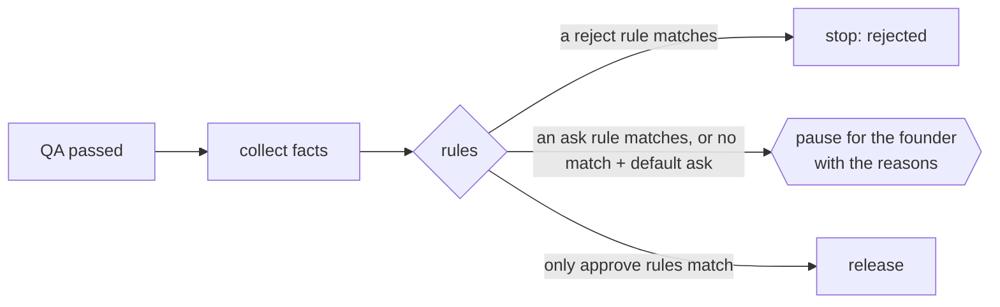

# Approvals (approval rules)

**Status:** Done (Phase 1, step 6): rules at the release gate, set per team template  
**Code:** `backend/app/features/approvals/` · used by `backend/app/features/workflows/nodes/approval.py` · rules in `backend/app/features/teams/templates/*.toml`  
**Last updated:** 2026-10-01

## What it is

The founder approves what matters, and the rules say what matters. Every build still reaches a **fixed release gate**; the team's approval rules decide what happens there. The gate can **ask** the founder (the default), **approve** on its own, or **reject** on its own, and it always says which rule decided and why. The software team asks about every release and says when something deserves extra care: "It changes secrets, dependencies, database or deployment settings." The operations team will use the same rules for money ("refunds over ₹2,000 need my OK").

## How it works

1. When a run reaches the gate, the workflow collects **facts** about it (`approval_facts()`):

| Fact | Meaning |
| --- | --- |
| `files_changed` | Paths the developers changed |
| `files_count` | How many |
| `tokens` | All model tokens in the run so far: the CTO's and the developers' |
| `tasks_count` | Tasks in the CTO's plan |
| `tasks_with_issues` | Tasks accepted with review comments still open |
| `tests_passed` | QA's final check passed (always true at the gate today: failing runs never reach it) |

2. Every **enabled** rule whose conditions (`when`) **all** hold matches. A rule with no conditions always matches.
3. **The strictest matching action wins:** reject, then ask, then approve. An approve rule can never wave through something another rule says needs the founder, wherever the rules sit in the file. With no match, `default` applies (ask, for the software team).
4. **Ask:** the run pauses as before. The gate carries `reasons` (every matching rule's sentence) and `rules` (their ids); `rules` is empty when only the default asked. The reasons show in the run (`GET /runs/{id}` → `gate`), the activity log ("Waiting for your approval to release: It changes …") and the standup's "Needs you".
5. **Approve or reject:** the run carries on without pausing, and an `approval.decided` event from `system` records it: "Approved the release by your rules: …" or "Stopped by your rules: …", with the rule ids.



### Writing rules (team template)

```toml
[approval]
default = "ask"
default_reason = "Every release needs your approval."

[[approval.rules]]
id = "sensitive_files"
action = "ask"                       # ask | approve | reject
reason = "It changes secrets, dependencies, database or deployment settings."
when = [{ fact = "files_changed", op = "matches_any", value = [".env*", "package.json", "migrations/*"] }]
```

Operators: `eq`, `ne`, `gt`, `gte`, `lt`, `lte`, and `matches_any` (shell-style patterns, matched against the full path or the file name). A missing fact, or a value of the wrong type, never matches. `enabled = false` keeps a rule in the file but switched off.

### The software team's rules

| Rule | Action | When |
| --- | --- | --- |
| `sensitive_files` | ask | Changes `.env*`, keys, requirements/pyproject/uv.lock, package.json/lock, Dockerfiles, docker-compose, `.github/*`, SQL or migrations |
| `open_review_comments` | ask | A task was accepted with review comments still open |
| `large_change` | ask | More than 15 files changed |
| `expensive_run` | ask | More than 1,000,000 tokens |
| `small_clean_change` | approve (**off**) | ≤ 3 files, no open review comments, tests passed. Turn it on to release small changes without asking; the ask rules still win when they match |
| default | ask | Every other release |

## Code map

| File | Responsibility |
| --- | --- |
| `schemas.py` | `ApprovalPolicy`, `ApprovalRule`, `Condition`, `Action`, `Verdict`, `STRICTNESS` |
| `service.py` | `evaluate(policy, facts)`, `holds()`, `matching()`, `policy_problems()` (template checks); pure functions |
| `workflows/nodes/approval.py` | `approval_facts(state)`, `make_approval_node(policy)`: evaluates, then interrupts or decides |
| `workflows/activity.py` | Records rule decisions as `approval.decided` |
| `teams/catalog.py` | `WORKFLOW_FACTS`: the facts each workflow provides |
| `teams/loader.py` | Rejects templates whose rules use unknown facts, a bad `matches_any` value, or duplicate ids |
| `workers/wiring.py` | Passes the template's policy to the graph (`TeamRuntime.approval_policy`) |

## API

None of its own. Rules are visible in the template (`GET /teams/templates/software`). Their effect shows in `GET /runs/{id}` (`gate.reasons`, `gate.rules`) and the activity log.

## Data model

None. Rules live in the team template file; the verdict is saved in the run's checkpoint (`state.approval`) and the activity log.

## Events

- `approval.requested` (cto): the summary ends with the reasons when a rule asked; `data.gate` holds `reasons` and `rules`.
- `approval.decided` (system): when rules approved or rejected; `data` has `approved`, `rules`, `by: "rules"`. The founder's own decisions are still recorded as `approval.decided` (founder) on resume.

## Dependencies

- **Used by:** `workflows` (the release gate), `teams` (the policy is part of a template, validated at load)
- **External services:** none
- **Config:** the `[approval]` section of the team template

## Design decisions

- 2026-10-01 — **The gate is fixed; rules decide what happens at it.** The founder can't accidentally remove the release step, and every outcome (asked, approved, rejected) goes through one place and is logged.
- 2026-10-01 — **Strictest wins, not first match.** With first match, the order of rules in a file decides safety; with strictest wins, adding an approve rule can only ever skip releases that nothing else flags.
- 2026-10-01 — **Default ask, auto-approve shipped switched off.** Interviewees want control first. Auto-approval is one line to turn on when a founder trusts the team.
- 2026-10-01 — Facts are a fixed list per workflow, checked when the template loads, so a typo in a rule fails at startup instead of silently never matching.
- 2026-10-01 — Rules live in the template (versioned like code) for now; per-company overrides come with companies and the admin page.
- 2026-10-01 — No rule rejects by cost at the release gate: the work is already done by then. Token budgets that stop a run early belong in the run itself (later).

## How to run and test

- Tests: `uv run pytest app/features/approvals app/features/workflows/tests/test_approval_rules.py` (rules releasing, pausing with reasons, rejecting, the default) and `tests/test_team_wiring.py` (facts match the catalog).
- Try it: start a run whose request adds a `requirements.txt`; `GET /runs/{id}` shows `gate.reasons`. To see auto-approval, set `enabled = true` on `small_clean_change`, restart the worker, and ask for a one-file change.

## Known limitations and gotchas

- One gate (release) for now; the spec and plan gates come with the PM in Phase 2 and will use the same rules.
- Rules are per team template, not per company yet.
- Templates are cached per process: restart the API and worker after editing rules.
- Facts are about this run only; rules like "more than 3 releases today" need history (later).

## Troubleshooting

| Symptom | Likely cause | Fix |
| --- | --- | --- |
| `InvalidTemplateError: approval rule … unknown facts` | The rule names a fact the workflow doesn't provide | Use one from the table above, or add it to `approval_facts()` and `WORKFLOW_FACTS` |
| A rule never matches | Wrong fact type (e.g. `"15"` instead of `15`), or the rule is `enabled = false` | Check the TOML value types |
| Auto-approve rule matched but the run still paused | An ask rule matched too (strictest wins) | See `gate.rules` for which |

## Changelog

| Date | Change |
| --- | --- |
| 2026-10-01 | Created: approval policies (ask / approve / reject, strictest wins), facts at the release gate, software team rules, reasons in the gate, activity log and standup |
