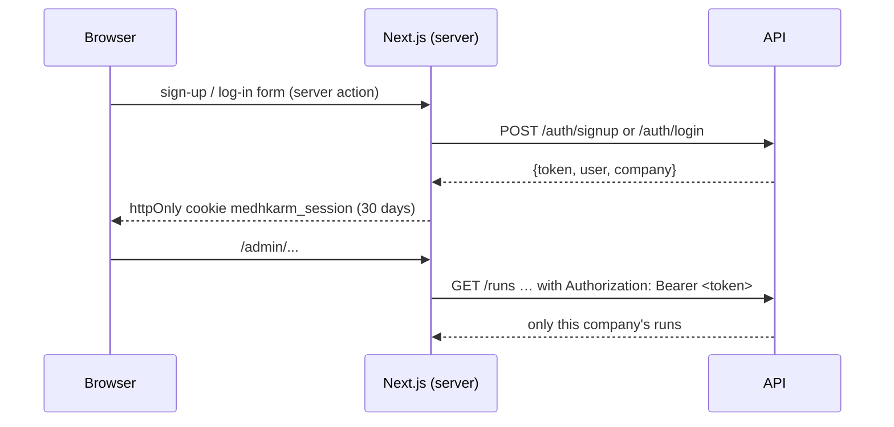

# Auth (sign-in)

**Status:** Done (Phase 3): email and password, one company per founder, every API route scoped to the signed-in founder's company  
**Code:** `backend/app/features/auth/` · `frontend/src/features/auth/` · `frontend/src/shared/api/session.ts` · migration `0009_companies_users`  
**Last updated:** 2026-10-05

## What it is

Before anyone else can use MedhKarm, each founder needs their own account, and must only ever see their own runs, projects and standups.
- **Signing up** creates the founder's **company** ([companies.md](companies.md)) with them as its first user.
- **Logging in** gives a session that lasts 30 days.
- **The API refuses everything except `/health` without a valid session.** It answers "not found" for another company's run or project, so it never confirms they exist.

We run sign-in ourselves (Pavan's choice, Oct 5, 2026): no outside account is needed. Password resets and Google sign-in come later (they need an email service).

## How it works

1. **Passwords:** scrypt from Python's standard library (n = 2^14, r = 8, p = 1) with a random salt each, stored as `scrypt$<salt>$<hash>`. An unknown email is checked against a dummy hash, so the response time doesn't reveal whether an account exists.
2. **Sessions:** a signed JWT (HS256, PyJWT) holding the user id and company id, valid for `AUTH_TOKEN_DAYS` (30). The API stays stateless: any process with `AUTH_SECRET` can check a token.
3. **In the browser:** the token lives in an **httpOnly** cookie (`medhkarm_session`, SameSite=Lax, Secure in production), so page scripts can never read it. The frontend's API client (`shared/api/client.ts`) runs only on the Next.js server and adds `Authorization: Bearer …` to every backend call.
   - The live activity stream goes through `app/api/runs/[runId]/events/stream`, which adds the token, because the browser's EventSource can't send headers.
4. **On the API:** `get_current_user` (`auth/dependencies.py`, `SignedIn`) reads the bearer token and returns `CurrentUser(user_id, company_id)`, or 401 `not_signed_in`.
   - **Runs:** created with the caller's company and listed by it. `OwnedRun` (in `runs/dependencies.py`) guards `GET /runs/{id}`, cancel, approval and every events route.
   - **Projects:** one router guard requires sign-in, and checks ownership on any route with a `project_id`.
   - **Standups:** cover only the company's runs.
   - **Team templates, MCP catalog, starter options:** need any signed-in founder.
5. **Logging out** deletes the cookie. Tokens aren't revoked on the server (see limitations).
6. **The first account adopts earlier work:** runs and projects made before sign-in existed (`company_id` empty) go to the first company created, so Pavan keeps his history. Later sign-ups start empty.
7. **The admin pages** (`app/admin/layout.tsx`) call `/auth/me` and send anyone not signed in to `/login`. The nav shows the company's name and a Log out button.

## Code map

| File | Responsibility |
| --- | --- |
| `auth/schemas.py` | `SignUp`, `LogIn`, `User`, `Session`, `Me`, `CurrentUser` |
| `auth/passwords.py` | `hash_password`, `check_password` |
| `auth/tokens.py` | `TokenIssuer`: issue and read JWTs |
| `auth/service.py` | `AuthService` (sign up, log in, me), `who_is()` |
| `auth/interfaces.py` | `UserRepository`, `DataAdopter` (runs and projects adopt unowned records) |
| `auth/repository.py` · `memory_repository.py` · `models.py` | The `users` table |
| `auth/dependencies.py` | `get_token_issuer` (dev secret fallback), `get_auth_service`, `get_current_user`, `SignedIn` |
| `auth/router.py` | `/auth/signup`, `/auth/login`, `/auth/me` |
| `auth/tests/helpers.py` | `sign_in(app)` for other features' API tests |
| `frontend/…/auth/` | `AuthForm`, `SignOutButton`, server actions (cookie), `getMe`, `parseForms` |
| `frontend/src/app/login`, `app/signup` | Thin pages |
| `frontend/src/app/api/runs/[runId]/events/stream/route.ts` | The live stream, through the app with the token |

## API

| Method | Path | Purpose | Auth |
| --- | --- | --- | --- |
| POST | `/auth/signup` | `{email, password (8+), name, company_name}` → 201 `{token, user, company}`; 409 `email_taken` | none |
| POST | `/auth/login` | `{email, password}` → `{token, user, company}`; 401 `invalid_credentials` | none |
| GET | `/auth/me` | `{user, company}` | Bearer |

Every other route except `/health` needs `Authorization: Bearer <token>`.

## Data model

`users`: `id` (uuid), `company_id` (FK `companies`, cascade), `email` (unique, lower-case), `name`, `password_hash`, `created_at`. Migration 0009 also adds foreign keys and indexes from `runs.company_id` and `projects.company_id` to `companies`.

## Events

None.

## Dependencies

- **Config:** `AUTH_SECRET` (required outside development; in development a fixed development secret is used, with a warning), `AUTH_TOKEN_DAYS` (30)
- **Libraries:** `pyjwt`
- **Used by:** `runs`, `events`, `projects`, `standups`, and the catalog routers (`main.py`)

## Design decisions

- 2026-10-05 — **Our own email and password** (Pavan), not Supabase Auth: no outside account, works today. A different provider would be a new token reader behind `get_current_user`.
- 2026-10-05 — **Stateless JWTs** keep the API stateless (CLAUDE.md). The cost: no server-side log-out yet.
- 2026-10-05 — **The token never reaches page scripts:** an httpOnly cookie plus server-side API calls, with the one browser stream proxied.
- 2026-10-05 — **Another company's records are "not found"**, never "forbidden", so the API doesn't confirm they exist.
- 2026-10-05 — **Scoping in the application first:** every query filters by company. Postgres row-level security as a second wall is a gap (G-41).

## How to run and test

- Tests: `uv run pytest app/features/auth`, plus the API tests of runs, events, projects and standups (another company's run is 404; signed out is 401).
- First time: open http://localhost:3000/admin, which sends you to log in; choose **Create an account**. Your earlier runs and projects become your company's.

## Known limitations and gotchas

- No password reset, email verification or Google sign-in yet.
- No server-side log-out or token revocation: a stolen token works until it expires. Changing `AUTH_SECRET` signs everyone out.
- One company per user; no inviting teammates yet.
- No limit on log-in attempts yet.
- Row-level security isn't enforced in Postgres (G-41).

## Troubleshooting

| Symptom | Likely cause | Fix |
| --- | --- | --- |
| The admin page always goes to /login | The backend isn't reachable, or `AUTH_SECRET` changed | Start the API; log in again |
| `RuntimeError: Set AUTH_SECRET` at start | `ENVIRONMENT` isn't `development` and no secret is set | Set `AUTH_SECRET` in `.env` |
| A run you just made is "not found" | Signed in as another account | Log out and in with the right one |

## Changelog

| Date | Change |
| --- | --- |
| 2026-10-05 | Created: email + password sign-up and log-in, companies, JWT sessions in an httpOnly cookie, every route scoped by company, first account adopts earlier work |
