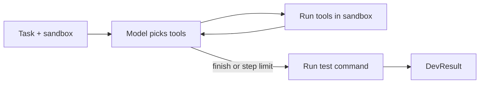

# Developer engine

**Status:** Built-in engine done (Phase 0); OpenHands engine next  
**Code:** `backend/app/features/developer_engine/`  
**Last updated:** 2026-10-01

## What it is

The part that actually writes code. It takes a task (description + test command) and a sandbox, and returns what changed and whether the tests pass. The rest of the system only knows the `DeveloperEngine` interface, so the engine behind it can be swapped: the built-in `ToolLoopEngine` now, OpenHands next, the Claude Agent SDK later for Claude users.

## How it works

`ToolLoopEngine.run_task()`:

1. Sends the model a system prompt, the task and the test command, plus five tools: `write_file`, `read_file`, `list_files`, `run_command`, `finish`.
2. Loops up to `max_steps` (default 15): the model calls tools; each call runs in the sandbox and its result goes back as a `tool` message. Tool errors (missing file, unsafe path) are returned as text so the model can recover, never raised.
3. Stops when the model calls `finish`, or at the step limit.
4. **Runs the test command itself.** `success` is our test result, never the model's claim.
5. Returns a `DevResult`: success, summary, files changed, test output, steps, total tokens.

## Code map

| File | Responsibility |
| --- | --- |
| `interfaces.py` | `DeveloperEngine` Protocol: `run_task(task, sandbox) -> DevResult` |
| `schemas.py` | `DevTask`, `DevResult` |
| `engines/tools.py` | Tool definitions for the model and how each runs in the sandbox (output capped at 4,000 characters) |
| `engines/tool_loop_engine.py` | `ToolLoopEngine`: the loop, the prompt, the final test run |

## API

None (used in-process by the workflows feature).

## Data model

None.

## Events

None yet.

## Dependencies

- **Other features used:** `models` (`LLMProvider`), `sandbox` (`Sandbox`), through their interfaces
- **Interfaces defined:** `DeveloperEngine` → `ToolLoopEngine`
- **External services:** none directly
- **Config:** none (model and sandbox are passed in)

## Design decisions

- 2026-10-01 — Built-in engine first, OpenHands second. It proves the model, sandbox and workflow pieces without OpenHands' large install and its own Docker images mixed in. OpenHands plugs in behind the same interface.
- 2026-10-01 — Success is decided by running the tests ourselves ("checks run the app").
- 2026-10-01 — Tool errors go back to the model as text, so one bad call doesn't end the task.

## How to run and test

- Unit tests (scripted model, in-memory sandbox): `uv run pytest app/features/developer_engine`
- Live: run a build (see [workflows.md](workflows.md)).

**Measured on 2026-10-01** with `gpt-oss:120b` on Ollama Cloud in Docker:

| Task | Result | Steps | Tokens | Time |
| --- | --- | --- | --- | --- |
| `calc.py` with add/divide + pytest tests | Passed (2 tests) | 6 | 4,285 | 24 s |
| `slugify.py` + pytest tests (inside the full graph) | Passed (5 tests) | 5 | 6,370 | ~30 s |

## Known limitations and gotchas

- The whole conversation is resent every step; long tasks will need context trimming.
- No diff output yet, only the list of changed files.
- Single-file edits only (`write_file` rewrites the whole file); fine for small tasks, costly for big files.

## Troubleshooting

| Symptom | Likely cause | Fix |
| --- | --- | --- |
| "step limit reached" summary | Model looped or the task is too big | Split the task, raise `max_steps`, or try a stronger model |
| Model writes code but tests never run | Test command needs a tool missing from the image (e.g. pytest) | Install it in the test command or use an image that has it |

## Changelog

| Date | Change |
| --- | --- |
| 2026-10-01 | Created: `DeveloperEngine` interface and built-in `ToolLoopEngine` |
