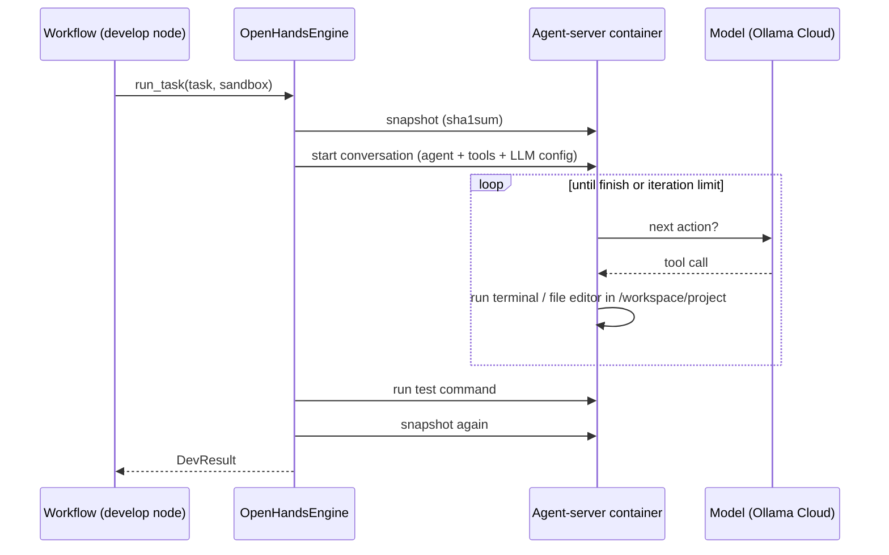

# Developer engine

**Status:** Two engines done (Phase 0): built-in and OpenHands  
**Code:** `backend/app/features/developer_engine/`  
**Last updated:** 2026-10-01

## What it is

The part that actually writes code. It takes a task (description + test command) and a sandbox, and returns what changed and whether the tests pass. The rest of the system only knows the `DeveloperEngine` interface, so engines are swappable:

| Engine | Setting | Sandbox it needs | Best for |
| --- | --- | --- | --- |
| `ToolLoopEngine` (built in) | `DEVELOPER_ENGINE=builtin` (default) | Any (`DockerSandboxProvider` in practice) | Small tasks, low token cost, fully under our control |
| `OpenHandsEngine` | `DEVELOPER_ENGINE=openhands` | `OpenHandsSandboxProvider` (agent server) | Larger, multi-file work: persistent terminal, targeted file edits, task tracking, context condensing |

The Claude Agent SDK is a planned third engine for Claude users.

## How it works

Both engines follow the same contract:

1. Note the workspace state.
2. Let the agent work in the sandbox.
3. **Run the test command ourselves.** `success` is our test result, never the agent's claim.
4. Return a `DevResult`: success, summary, files changed, test output, steps, total tokens.

### ToolLoopEngine

1. Sends the model the developer role's instructions (from the team template, [teams.md](teams.md)), the task and the test command, plus the role's tools (by default five: `write_file`, `read_file`, `list_files`, `run_command`, `finish`. A sixth, `apply_patch`, is offered only when `BUILTIN_APPLY_PATCH=true` (off by default; see design decisions). Patches the model sends anyway are still applied.
   - `apply_patch` takes OpenAI's patch format (`*** Begin Patch` … `*** End Patch`), which `gpt-oss` is trained to write: add, update with context hunks, move and delete files.
   - Once a patch is handled, its text in the conversation is replaced by a short note ("patch already handled: … read the files for their current content"). The model sometimes names the argument `patch` instead of `input`; both work.
   - If the model sends a patch through `run_command` (it often tries `apply_patch` as a shell command), the call is rewritten into a real `apply_patch` call before it runs or enters the conversation.
2. Loops up to `max_steps` (`BUILTIN_MAX_STEPS`, default 25): each tool call runs in the sandbox and its result goes back as a `tool` message. Tool errors are returned as text so the model can recover.
3. Stops at `finish` or the step limit.

### OpenHandsEngine

1. Refuses any sandbox that isn't an `AgentServerSandbox` (`IncompatibleSandboxError`).
2. Hashes every workspace file (`workspace_snapshot.snapshot`).
3. Builds an OpenHands `LLM` from our `ModelConfig` (same model, endpoint and key as everything else), an `Agent` with OpenHands' default tools minus the browser, and a `RemoteWorkspace` pointing at the sandbox's agent server.
4. Starts a `Conversation`, sends the task prompt and runs it to completion (up to `OPENHANDS_MAX_ITERATIONS`, default 50; the SDK also stops at 1 hour). This is blocking SDK code, so it runs in a thread.
5. Reads the final answer, token usage and number of actions; closes the conversation.
6. Hashes the workspace again: new or modified files are `files_changed`.

### Extra tools and access limits

`ToolLoopEngine(..., tool_sources=[...])` takes **tool sources** (`interfaces.py`: `ToolSource` opens a `ToolSession` per task with `list_tools()` and `call()`). Their tools are offered next to the built-in ones; calls to them are routed to the session, which enforces its own limits. MCP servers are the first source ([integrations.md](integrations.md)). The engine runs **only tools it offered**: any other name is refused with "Not allowed: …" and logged ("Tried X, which isn't one of its tools"). A patch is still applied for roles that may `write_file`.

## Code map

| File | Responsibility |
| --- | --- |
| `interfaces.py` | `DeveloperEngine` Protocol: `run_task(task, sandbox, recorder=None) -> DevResult`; the optional `RunRecorder` receives each tool use and model call |
| `schemas.py` | `DevTask`, `DevResult` |
| `exceptions.py` | `IncompatibleSandboxError` |
| `engines/tools.py` | Built-in engine's tool definitions, how each runs in the sandbox (output capped at 4,000 characters), and `normalize_call()` |
| `engines/patch.py` | Parser and applier for the `apply_patch` format (pure functions) |
| `engines/tool_loop_engine.py` | `ToolLoopEngine` |
| `engines/openhands_engine.py` | `OpenHandsEngine` |
| `engines/workspace_snapshot.py` | Hash the workspace; list new or modified files |

Engine selection lives in `app/workers/build_run.py` (`build_engine()`), the only place concrete classes are chosen.

## API

None (used in-process by the workflows feature).

## Data model

None.

## Events

None yet. OpenHands produces a detailed event stream (every action and observation); feeding it to the event log and office view is future work.

## Dependencies

- **Other features used:** `models` (`LLMProvider`, `ModelConfig`), `sandbox` (`Sandbox`, `AgentServerSandbox`), through their interfaces
- **Interfaces defined:** `DeveloperEngine` → `ToolLoopEngine`, `OpenHandsEngine`
- **Libraries:** `openhands-sdk`, `openhands-tools` (OpenHands engine only; imported only when chosen)
- **Config:** `DEVELOPER_ENGINE`, `BUILTIN_MAX_STEPS`, `BUILTIN_APPLY_PATCH`, `OPENHANDS_MAX_ITERATIONS`, `OPENHANDS_SUPPRESS_BANNER`

## Design decisions

- 2026-10-01 — Built-in engine first, OpenHands second, so problems in our own pieces weren't mixed with OpenHands setup issues.
- 2026-10-01 — Success is decided by running the tests ourselves, for every engine.
- 2026-10-01 — OpenHands runs *inside the sandbox* (its agent server), not on our machine, so its terminal and file tools touch only the sandbox. Hence the `AgentServerSandbox` requirement.
- 2026-10-01 — The OpenHands SDK (`openhands-sdk` 1.50), not the full OpenHands app: it's the embeddable library.
- 2026-10-01 — Added `apply_patch`. Root cause of the eval suite's "Ollama outages": `gpt-oss` ran `apply_patch` as a shell command, which doesn't exist; the conversation filled with failed patches, and Ollama Cloud then returned HTTP 500 for it every time (0/3 on replay; 3/3 once the same history used a real `apply_patch` tool). The notes-API and reminders tasks triggered it in every run.
- 2026-10-01 — `apply_patch` is off by default (`BUILTIN_APPLY_PATCH`). With it on, the eval suite on `gpt-oss:120b` scored 13/16 at a median of 51k tokens per task, against 15/15 at 24k with whole-file edits. The patch handling stays as a safety net for patches the model sends without being offered the tool.
- 2026-10-01 — Applied patches are compacted in the conversation. Even successful `apply_patch` calls left in the history made Ollama Cloud's `gpt-oss:120b` return HTTP 500 (0/3 on replay); compacted, 3/3. `gpt-oss:20b` and `gemma4:31b` handled the same history fine, so it's specific to that endpoint. Compacting also stops big patches being resent every step.
- 2026-10-01 — Changed-file detection uses workspace hashes for both engines (patched files count).
- 2026-10-01 — Built-in step limit raised from 15 to 25 and made a setting: in the eval suite, most genuine failures (and 6 passes) hit 15 steps.
- 2026-10-01 — Changed files are found by hashing, so modified files count too, not just new ones.

## How to run and test

- Unit tests: `uv run pytest app/features/developer_engine`
- Live: `uv run python -m app.workers.build_run start --engine openhands --request "..." --test-command "..."` (see [workflows.md](workflows.md)).

**Measured on 2026-10-01** with `gpt-oss:120b` on Ollama Cloud:

| Engine | Task | Result | Steps | Tokens | Time |
| --- | --- | --- | --- | --- | --- |
| Built-in | `calc.py` with add/divide + pytest tests (engine only) | Passed (2 tests) | 6 | 4,285 | 24 s |
| Built-in | `slugify.py` + pytest tests (full graph) | Passed (5 tests) | 5 | 6,370 | ~30 s |
| OpenHands | `slugify.py` + pytest tests (full graph) | Passed (4 tests) | 7 | 67,243 | 65 s (incl. container start) |

OpenHands used about 10× the tokens on this small task: its system prompt and tool definitions are much larger. The trade-off should pay off on bigger, multi-file tasks; the eval suite in Phase 2 will measure it.

## Known limitations and gotchas

- Built-in: the whole conversation is resent every step; `write_file` rewrites whole files.
- OpenHands: high fixed token cost per task; the run can't be paused mid-task (only between graph steps).
- Neither engine returns a diff yet, only the list of changed files.
- If `OPENHANDS_SERVER_IMAGE` and the installed `openhands-sdk` versions drift apart, the client and server may disagree. Upgrade them together.

## Troubleshooting

| Symptom | Likely cause | Fix |
| --- | --- | --- |
| "step limit reached" summary (built-in) | Model looped or the task is too big | Split the task, raise `BUILTIN_MAX_STEPS`, or try a stronger model |
| `IncompatibleSandboxError` | OpenHands engine paired with the plain Docker sandbox | Use `DEVELOPER_ENGINE=openhands` (wires both together) |
| Tests never run | Test command needs a tool missing from the image (e.g. pytest) | Install it in the test command or use an image that has it |
| OpenHands run ends with an empty summary | Agent hit the iteration limit | Raise `OPENHANDS_MAX_ITERATIONS` or split the task |

## Changelog

| Date | Change |
| --- | --- |
| 2026-10-01 | `tool_sources` (MCP tools, per-role limits); only offered tools run, others are refused and logged |
| 2026-10-01 | Built-in engine takes `tools` and `instructions` (from the team template's developer role); replaces `offer_apply_patch` |
| 2026-10-01 | Engines record `tool.used` and `model.used` events (activity log) |
| 2026-10-01 | `apply_patch` made opt-in via `BUILTIN_APPLY_PATCH` (default off) |
| 2026-10-01 | Patch parser ignores repeated or joined `*** Begin/End Patch` markers (the model repeats them; rejecting them made it loop) |
| 2026-10-01 | Applied patches compacted in the conversation; `patch` accepted as an alias for `input` |
| 2026-10-01 | `apply_patch` tool and patch-in-shell rewrite; hash-based changed files for the built-in engine |
| 2026-10-01 | Built-in step limit 15 → 25, configurable via `BUILTIN_MAX_STEPS` |
| 2026-10-01 | Added `OpenHandsEngine`, `IncompatibleSandboxError`, hash-based change detection |
| 2026-10-01 | Created: `DeveloperEngine` interface and built-in `ToolLoopEngine` |
