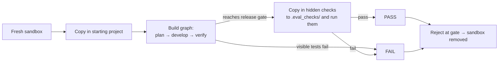

# Evals

**Status:** Done (Phase 0): 20 tasks, validator, runner, reports. Baseline: 18 of 19 scored tasks pass  
**Code:** `backend/app/features/evals/` · tasks in `backend/evals/` · entry point `backend/app/workers/run_evals.py`  
**Last updated:** 2026-10-01

## What it is

A fixed set of 20 realistic coding tasks that we run the software team against, to measure how often it delivers correct work, at what cost and how fast. It's how we decide whether a change (new model, new engine, new prompt) made the team better or worse, and it's what the roadmap gates measure (Gate 2: at least 12 of 20 pass).

Most tasks are changes to **existing projects**, like a solo builder's real work: fix a bug, add a feature, refactor. A few create a new module.

## How a task is scored

Each task has a request (what a founder would ask), a **visible** test command the team runs while working, and **hidden acceptance tests** the team never sees. A task passes only if both pass. This is the approach of public coding benchmarks such as SWE-bench: the hidden tests catch work that "passes its own tests" but misses the request.



The runner uses the **real build workflow** (same graph, same developer engines, same checking step), with in-memory checkpoints instead of Postgres.

## The 20 tasks

| Project | Language | Tasks |
| --- | --- | --- |
| `py-inventory`: shop stock tracking | Python | bug: total value ignores quantity · remove item · low-stock report · save/load JSON · refactor into a package |
| `py-bookings`: salon appointment book | Python | bug: back-to-back bookings rejected · cancellation with refund tiers · 24-hour reminders · CSV export |
| `py-notes-api`: FastAPI notes service | Python | PATCH endpoint · search · input validation (422s) · pagination |
| `js-cart`: shopping cart (ES modules, `node:test`) | JavaScript | bug: float rounding · discount codes · GST by category · set quantity |
| (none: new module) | Python, JavaScript | slugify · Roman numerals · word frequency |

By kind: 4 bugs, 12 features, 1 refactor, 3 new modules. By difficulty: 10 easy (1), 10 medium (2).

## Validating the tasks

`validate` checks every task is fair, without calling any model. In a fresh sandbox it confirms:

1. the hidden checks **fail** on the untouched starting project (the task isn't already solved), and
2. with the reference solution in `solution/`, the visible tests **and** hidden checks **pass** (the task is solvable as written).

All 20 passed validation on 2026-10-01 (about 15 seconds). Run it after editing any task.

## Code map

| File | Responsibility |
| --- | --- |
| `schemas.py` | `EvalTask`, `TaskOutcome`, `EvalReport`, `ValidationOutcome` |
| `loader.py` | Reads `task.toml` files and file trees from `backend/evals/` |
| `workspace.py` | Copies projects, hidden checks and solutions into a sandbox; runs the hidden checks |
| `runner.py` | `EvalRunner`: one task through the build workflow, scored; runs many in parallel |
| `validator.py` | `TaskValidator`: proves tasks are fair and not already solved |
| `report.py` | Markdown summary (by kind, language, difficulty) and JSON results |
| `exceptions.py` | `EvalTaskError` (bad task files) |
| `app/workers/run_evals.py` | CLI: `list`, `validate`, `run`; wires engine, sandbox and image |

### Task files (`backend/evals/`)

```
repos/<project>/...        starting projects, shared by several tasks
tasks/<id>/task.toml       id, title, kind, difficulty, language, repo, request,
                           test_command (visible), check_command (hidden),
                           solution_delete (files the solution removes)
tasks/<id>/checks/...      hidden acceptance tests → copied to .eval_checks/
tasks/<id>/solution/...    reference solution (validate only)
results/                   run reports (git-ignored)
sandbox image              backend/sandbox-image/Dockerfile
```

## API

None. Command line:

```bash
uv run python -m app.workers.run_evals list
uv run python -m app.workers.run_evals validate [--tasks id1,id2] [--parallel 4]
uv run python -m app.workers.run_evals run [--engine builtin|openhands] [--model ollama_chat/gpt-oss:20b] [--tasks id1,id2] [--parallel 2]
```

## Data model

None in the database. Each run writes `backend/evals/results/<time>-<engine>.json` (every outcome) and `.md` (summary).

## Events

None.

## Dependencies

- **Other features used:** `workflows` (`WorkflowService`, build graph, `WorkChecker`), `sandbox`, `developer_engine` and `models` (through the shared wiring in `app/workers/wiring.py`)
- **Sandbox image:** `medhkarm-sandbox:dev` (Python 3.13, Node 20, pytest, FastAPI, httpx2), built automatically from `backend/sandbox-image/` on first use. The OpenHands engine uses its own image and installs the test tools at the start of each task.
- **Config:** `EVAL_SANDBOX_IMAGE`, plus the usual model and engine settings

## Design decisions

- 2026-10-01 — Mostly tasks on existing projects, because interviewees want an AI team working on their own projects.
- 2026-10-01 — Hidden acceptance tests plus a reference solution per task, so we measure correctness against the request, and can prove every task is fair.
- 2026-10-01 — The runner drives the real build graph (not the engine alone), so evals measure what customers get, including planning and the checking step.
- 2026-10-01 — Hidden checks live in `.eval_checks/`: dot-folders are skipped by the sandbox file listing and by pytest's test discovery.
- 2026-10-01 — Tasks run in our own sandbox image with test tools preinstalled, so results don't depend on downloading packages mid-run.
- 2026-10-01 — `evals/` is excluded from Ruff: tasks are sample customer projects, and their style is part of the test.

## How to run and test

- Unit tests (fakes, no Docker or model): `uv run pytest app/features/evals`
- Validate the tasks: `uv run python -m app.workers.run_evals validate`
- Full run: `uv run python -m app.workers.run_evals run` (needs Docker and `OLLAMA_API_KEY`)

**Results:** see the "Results" section below.

## Adding a task

1. Create `backend/evals/tasks/<id>/task.toml` (copy an existing one; `id` must equal the folder name).
2. Put hidden tests in `checks/` (Python: imports work from the project root; JavaScript: import `../<file>`).
3. Put the reference solution in `solution/` (full files that replace the project's), and list deleted files in `solution_delete`.
4. Run `validate --tasks <id>` until it says OK.

## Known limitations and gotchas

- All results above predate the CTO planning and review step (Oct 1, 2026); rerun the suite before comparing.
- Model outages are reported as **errored**, not failed, and aren't scored. The summary prints the command to rerun them.

- 20 tasks is small: one task is 5 percentage points, so compare runs on the same model and engine, and watch for noise between runs.
- All tasks are small projects (one to three files); larger codebases come with real beta projects.
- No new-app tasks on the Next.js + Supabase stack yet.
- Free Ollama Cloud models are rate-limited; keep `--parallel` low (2).

## Troubleshooting

| Symptom | Likely cause | Fix |
| --- | --- | --- |
| `validate` says "already pass on the starting project" | Hidden checks too weak, or the project already does it | Strengthen the checks |
| `validate` says "solution fails" | Reference solution or checks are wrong | Fix whichever is wrong; rerun `validate --tasks <id>` |
| Many tasks fail with `ModelCallError` | Ollama Cloud limits or outage | Lower `--parallel`; rerun later |
| `Timed out after 1200s` | Agent stuck | Check the task; the run continues with the next task |

## Results

| Date | Engine | Model | Passed | Notes |
| --- | --- | --- | --- | --- |
| 2026-10-01 | builtin | **gpt-oss:20b** | **16/20, 0 errored** | Whole-file edits. Median 34k tokens, 75 s per task; only 4 retries in the whole run. Misses: CSV export, reminders, JSON persistence, low stock. **Chosen as the development default** |
| 2026-10-01 | builtin | gemma4:31b | 14/16 run, 0 errored | Stopped after 16 tasks (enough to show it's reliable too) |
| 2026-10-01 | builtin | gpt-oss:120b | 13/16 run, 4 errored | `apply_patch` + compaction, parser fixed. Median tokens 51k (about 2× the run without `apply_patch`); two booking tasks hit the 25-step limit; errors persist from other `gpt-oss:120b` triggers. Conclusion: whole-file edits work better with this model |
| 2026-10-01 | builtin | gpt-oss:120b | 13/16 run, 4 errored | `apply_patch` + compaction, but with a parser bug (rejected repeated End markers): agent looped, median tokens doubled to 48k. Not representative |
| 2026-10-01 | builtin | gpt-oss:120b | 15/15 run, 5 errored | 25-step limit, before `apply_patch`; the errors were `gpt-oss:120b` choking on patch-in-shell history |
| 2026-10-01 | builtin | gpt-oss:120b | 15/15 run, 5 errored | Second full run, after adding retries with growing waits |
| 2026-10-01 | builtin | gpt-oss:120b | 3/4 run, 1 errored | Rerun of the 5 errored tasks, one at a time |
| 2026-10-01 | builtin | gpt-oss:120b | 13/15 run, 5 errored | First full run (errors were counted as failures then) |

**Development default: `gpt-oss:20b`, 16 of 20 with no errors.** `gpt-oss:120b` scores slightly higher per task that runs (15 of 15 at best) but about 1 in 4 tasks fails on Ollama Cloud errors, so it can't be relied on. Evaluation paused here on Oct 1, 2026; rerun when the engine or model changes, and with paid models later. Earlier baseline (second run + rerun): 18 of 19 scored tasks pass (95%); `notes-feature-pagination` errored twice but passed in the first run. Gate 2 asks for 12 of 20.

What the runs show:

- **Ollama Cloud's free tier is the biggest problem**, not the agent: 5 of 20 tasks errored in each full run, even with retries over about a minute. Real comparisons need a more reliable model endpoint (a paid tier or another provider).
- **The 15-step limit is the main agent failure mode.** Every genuine failure but one, and 6 passes, hit the limit. The agent tends to re-read and re-run tests. Raising the limit to 25, or a shorter test-output loop, should help.
- **Genuine misses were spec details:** an empty inventory crashing a Decimal sum, "é" kept in a slug when only a–z was allowed. Each of these tasks passed in another run, so results vary between runs; compare averages over several runs, not single runs.
- **Cost:** median about 25,000 tokens and 45 seconds per task with the built-in engine. The OpenHands engine hasn't been run on the suite yet.

## Changelog

| Date | Change |
| --- | --- |
| 2026-10-01 | Errored tasks (model or sandbox failures) reported separately and not scored; first baseline recorded |
| 2026-10-01 | Created: 20 tasks on 4 projects, validator, runner, reports, sandbox image |
