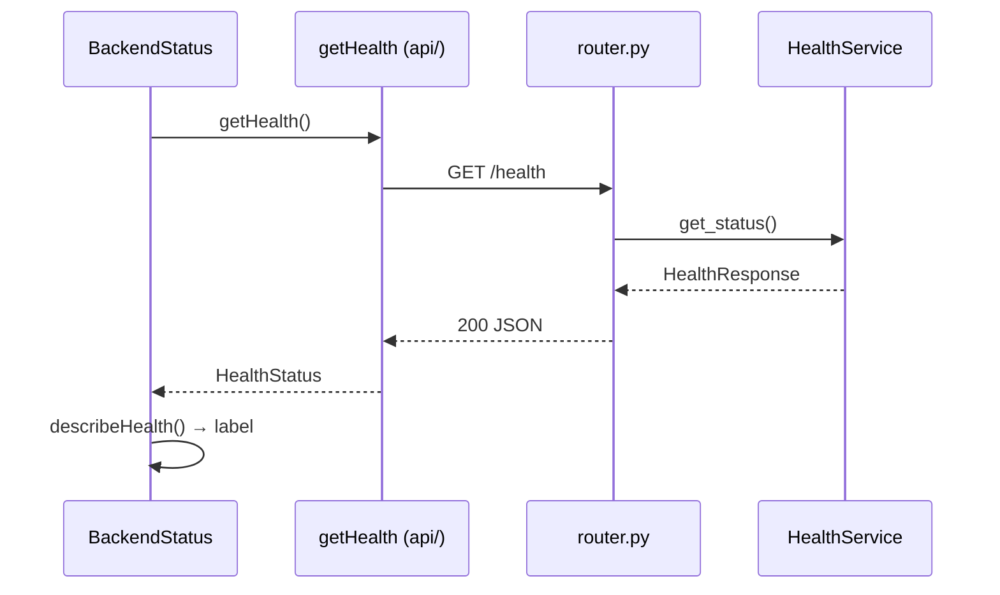

# Health

**Status:** Done  
**Code:** `backend/app/features/health/` · `frontend/src/features/health/`  
**Last updated:** 2026-10-01

## What it is

A health check that says whether the backend API is up, and which version and environment it's running. It's used by the home page today, and later by uptime monitors and deploy checks. It's also the reference example of the feature folder pattern on both sides: copy its shape when starting a new feature.

## How it works

1. The home page (`frontend/src/app/page.tsx`) renders `BackendStatus` from the health feature.
2. `BackendStatus` (a server component) calls `getHealth()`, which uses the shared API client to `GET /health`.
3. The backend router calls `HealthService.get_status()`, which builds the response from app settings.
4. `describeHealth()` turns the response, or `null` if the call failed, into the label and dot colour shown.

## Code map

| File | Responsibility |
| --- | --- |
| `backend/app/features/health/router.py` | `GET /health` endpoint |
| `backend/app/features/health/service.py` | `HealthService`: builds the status from settings |
| `backend/app/features/health/schemas.py` | `HealthResponse` model |
| `backend/app/features/health/dependencies.py` | Wires `HealthService` with settings for FastAPI |
| `backend/app/features/health/tests/test_health.py` | Service test + endpoint test on a feature-only app |
| `frontend/src/features/health/api/getHealth.ts` | Calls the backend (no caching) |
| `frontend/src/features/health/describeHealth.ts` | Pure function: response → label + healthy flag |
| `frontend/src/features/health/components/BackendStatus.tsx` | Server component showing the status line |
| `frontend/src/features/health/index.ts` | Public exports: `BackendStatus`, `HealthStatus` |

## API

| Method | Path | Purpose | Auth |
| --- | --- | --- | --- |
| GET | `/health` | Liveness: status, service name, version, environment | None |

Example response: `{"status":"ok","service":"MedhKarm API","version":"0.1.0","environment":"development"}`

## Data model

None. The feature doesn't touch the database.

## Events

None.

## Dependencies

- **Other features used:** none
- **Interfaces:** none
- **External services:** none
- **Config:** `app_name`, `app_version`, `environment` from `app/core/config.py`; frontend `NEXT_PUBLIC_API_URL`

## Design decisions

- 2026-10-01 — Liveness only, no database check. `/health` stays fast and never fails because of a dependency. A separate readiness check (database, Redis) can be added when deploys need it.
- 2026-10-01 — The feature test mounts only the health router on its own FastAPI app instead of importing `app.main`. Features must not import entry points (import-linter layer rule); whole-app checks live in `backend/tests/test_app.py`.
- 2026-10-01 — Display logic lives in `describeHealth()`, a pure function, so it's unit-tested without rendering React.

## How to run and test

- Backend: `cd backend && uv run pytest app/features/health`
- Frontend: `cd frontend && npx vitest run src/features/health`
- Manually: start both (see [local-setup.md](../local-setup.md)) and open http://localhost:3000

## Known limitations and gotchas

- No readiness check yet (database, Redis).
- The version is set in `config.py`, not read from `pyproject.toml`; keep them in sync.

## Troubleshooting

| Symptom | Likely cause | Fix |
| --- | --- | --- |
| "Backend unreachable" on the home page | Backend down or `NEXT_PUBLIC_API_URL` wrong | See [local-setup.md](../local-setup.md#troubleshooting) |

## Changelog

| Date | Change |
| --- | --- |
| 2026-10-01 | Created with the initial project setup |
