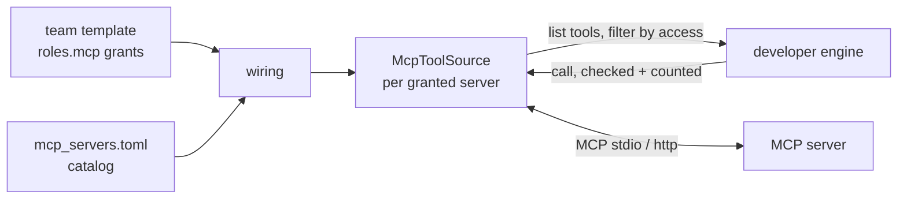

# Integrations (MCP tools)

**Status:** Done (Phase 1, step 8): MCP servers as agent tools, with per-agent access limits; first server `python_docs`  
**Code:** `backend/app/features/integrations/` · catalog `backend/app/features/integrations/mcp_servers.toml` · role access in `backend/app/features/teams/templates/*.toml`  
**Last updated:** 2026-10-01

## What it is

Agents get extra tools from **MCP servers** (Model Context Protocol, the standard way to plug tools into AI agents) instead of us writing every integration ourselves: GitHub, web fetch, databases and so on, as official servers. Each role says **which servers it may use, which of their tools, whether only read-only tools, and how many calls per task**. Agents never see, or get to call, anything outside that. The first server is our own small, offline `python_docs`, so developers can look up the real Python standard-library API instead of guessing.

## How it works

1. **The catalog** (`mcp_servers.toml`) lists the servers the platform can run: how to start or reach each one (`stdio` command, or `http` URL), the environment variables it needs (names only; secrets stay in `.env`), and whether it's switched on.
2. **The team template** grants servers to roles:

   ```toml
   [[roles.mcp]]
   server = "python_docs"
   tools = ["lookup", "members"]   # names or patterns, e.g. "get_*"; default all
   read_only = true                # only tools the server marks read-only (default)
   max_calls = 10                  # per task (default 20)
   ```

   The template loader rejects grants to servers that aren't in the catalog.
3. **Wiring** (`build_engine`) turns the developer role's grants into `McpToolSource`s for the built-in engine. Grants to switched-off servers are skipped with a log line.
4. **Per task**, the engine opens each source (`AsyncExitStack`): the server starts (stdio) or is connected to (http), its tools are listed, and only **permitted** ones are offered to the model, named `<server>__<tool>` (e.g. `python_docs__lookup`) so servers never clash. When the task ends, the sessions close and stdio servers stop.
5. **Every call is checked again:** a tool that wasn't offered is refused ("Not allowed: …"), and after `max_calls` the agent is told to carry on without it ("Limit reached: …"). Server errors and timeouts (`timeout_seconds`, default 30) come back as text, so a broken server never breaks the build.
6. **The activity log** shows each use: "Used python_docs: lookup (calendar.monthrange)"; a refused call shows as "Tried X, which isn't one of its tools".



**Read-only is decided by the server**, through the tool's `readOnlyHint` annotation. A tool without the hint counts as "may change things", so a `read_only` grant never offers it.

### Limits on built-in tools too

The engine now runs **only tools it offered**. Before this change, a model naming a built-in tool its role wasn't given (e.g. `write_file` for a read-only role) would still have run it. Now the call is refused and logged. The one exception: a patch from a role that may `write_file` is still applied, since it's just another way to write files.

### The servers

| Server | What | State |
| --- | --- | --- |
| `python_docs` | `lookup(name)`: documentation for a standard-library module, class, function or method (`csv.DictWriter`, `pathlib.Path.glob`); `members(module)`: its public classes and functions, one line each. Offline, read-only, standard-library modules only (a few with side effects on import, like `antigravity`, are refused) | On; granted to developers (both tools, read-only, 10 calls per task) |
| `fetch` | Official MCP fetch server: a web page as text | Off: downloads `mcp-server-fetch` with `uvx` on first use; turn on deliberately |
| `github` | Official GitHub MCP server (http) | Off: comes with repo onboarding in Phase 2; needs `GITHUB_TOKEN` |

## Code map

| File | Responsibility |
| --- | --- |
| `schemas.py` | `McpServer` (catalog entry), `McpAccess` (a role's grant), `McpServerSummary` |
| `mcp_servers.toml` | The catalog |
| `loader.py` | `load_servers()` (validated, cached), `access_problems()` for templates |
| `access.py` | `permitted(tool, access)`, `exposed_name(server, tool)`: pure policy |
| `mcp_source.py` | `McpToolSource` / `McpToolSession`: connect (stdio or streamable HTTP), list and filter tools, checked and counted calls, results as text |
| `service.py` | `list_servers()`, `tool_sources(grants)`, `access_problems` (what other features use) |
| `router.py` | API |
| `servers/python_docs.py` | The `python_docs` MCP server (FastMCP, stdio) |
| `developer_engine/interfaces.py` | `ToolSource` / `ToolSession`: how the engine sees extra tools (nothing MCP-specific) |
| `developer_engine/engines/tool_loop_engine.py` | Opens the sources per task, offers their tools, routes calls, refuses everything not offered |
| `teams/schemas.py` · `teams/loader.py` | `RoleSpec.mcp`, validated against the catalog |
| `workers/wiring.py` | `build_engine()` passes the developer role's tool sources |

## API

| Method | Path | Purpose | Auth |
| --- | --- | --- | --- |
| GET | `/integrations/mcp-servers` | The catalog: id, title, description, transport, enabled | None yet |

## Data model

None. The catalog and the grants are files in the repository.

## Events

No new types. MCP tool calls are `tool.used` events from the developer ("Used python_docs: lookup (csv.DictWriter)"), with `data.tool` = the exposed name. Refused calls are `tool.used` too ("Tried write_file, which isn't one of its tools").

## Dependencies

- **Used by:** `teams` (validates grants), the worker's wiring (tool sources for the developer)
- **Interfaces implemented:** `developer_engine.interfaces.ToolSource`
- **Libraries:** `mcp` (official Python SDK: client and FastMCP server), `httpx` for http servers
- **Config:** none of its own. Servers' `env` names are read from the environment (e.g. `GITHUB_TOKEN`); stdio servers inherit only `PATH`, `HOME`, `LANG`, `PYTHONPATH`, `VIRTUAL_ENV`, `TMPDIR` plus their listed variables, so they never see our API keys

## Design decisions

- 2026-10-01 — **MCP for tools**: official servers exist for most things founders use (GitHub, Supabase, Vercel, Linear, Notion); "buy, don't build, the plumbing" (roadmap principle 5).
- 2026-10-01 — **The engine knows tool sources, not MCP.** `ToolSource` is a two-method interface; MCP is one implementation, so a direct API integration or the Claude Agent SDK's MCP support can slot in without touching the engine.
- 2026-10-01 — **Limits live in the source and are checked twice**: the agent only sees permitted tools, and every call is checked and counted again, because models sometimes call tools they weren't offered.
- 2026-10-01 — **Read-only by default, and decided by the server's annotation.** Missing annotations count as "may change things".
- 2026-10-01 — **Servers run on the worker, outside the sandbox**, so only catalogued (trusted) servers run, they get a minimal environment, and secrets are referenced by name, never written in files.
- 2026-10-01 — `fetch` and `github` are listed but off: one needs a download, the other a token and repo onboarding.
- 2026-10-01 — Our own first server (`python_docs`) is offline, free and read-only: useful today at ₹0, and a working example for writing servers.

## How to run and test

- Tests: `uv run pytest app/features/integrations app/features/developer_engine/tests/test_tool_sources.py`. `test_python_docs.py` starts the real server over stdio (about half a second) and checks access filtering and the call limit.
- See it in a build: in the admin page's activity feed, look for "Used python_docs: …" (developers use it when unsure of an API, or when the request asks them to).
- Live check (Oct 1, 2026, gpt-oss:20b): asked directly to use the tool, the developer called `python_docs: lookup (calendar.monthrange)` and answered correctly in 2 steps and 1,248 tokens. In a normal build, even when told to check the docs, the same model preferred running small Python snippets and never called the tool: offered tools are optional, and small models lean on `run_command`.

## Known limitations and gotchas

- Only the built-in developer engine uses MCP grants. The OpenHands engine has its own MCP support; wire it when needed. The CTO and QA don't use tools yet.
- One session per task: a stdio server starts for each developer task (about 0.5 s for `python_docs`).
- Grants are per role in the template, not per company or project yet; customer-connected servers (their GitHub, their Supabase) come with companies and OAuth in Phase 2.
- `max_calls` is per task, not per run or per day.
- Restart the worker after editing the catalog or a template (both are cached).

## Troubleshooting

| Symptom | Likely cause | Fix |
| --- | --- | --- |
| `InvalidTemplateError: unknown MCP server` | The template grants a server that isn't in `mcp_servers.toml` | Add it to the catalog, or fix the id |
| No `python_docs__…` tools offered | Server disabled, or the role has no grant | `GET /integrations/mcp-servers`; check `[[roles.mcp]]` |
| "Error from …: TimeoutError" in tool results | Server slow or stuck | Raise `timeout_seconds` for that server, or check it runs on its own |
| A server tool never appears though granted | `read_only = true` and the server doesn't mark it read-only | Grant with `read_only = false` only if you trust what it does |

## Changelog

| Date | Change |
| --- | --- |
| 2026-10-01 | Created: MCP server catalog, per-role grants (tools, read-only, call limit), MCP tool source for the built-in engine, `python_docs` server, `/integrations/mcp-servers` |
