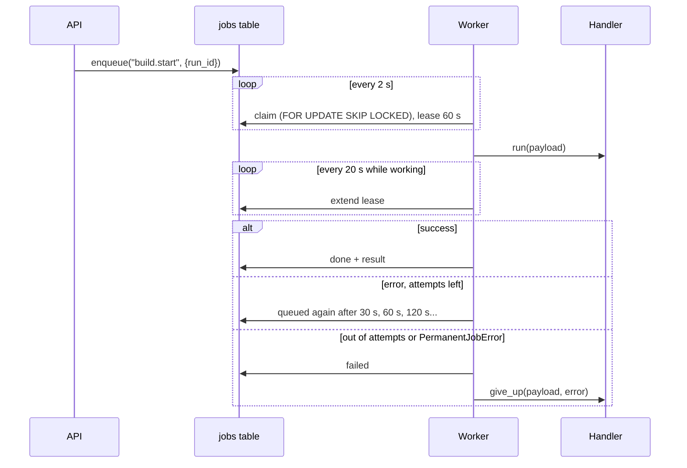

# Jobs (background job queue)

**Status:** Done (Phase 1, step 5): Postgres job queue, worker loop, build and standup jobs  
**Code:** `backend/app/features/jobs/` · worker `backend/app/workers/main.py` · handlers `backend/app/workers/handlers/` · migration `backend/alembic/versions/0003_jobs_and_runs.py`  
**Last updated:** 2026-10-01

## What it is

Long work (a build takes minutes) never runs inside an API request. The API writes a **job** into the `jobs` table and answers straight away; **worker** processes take jobs from the table and do them. Jobs survive restarts. If a worker dies mid-job, another worker takes the job over and the build carries on from its last saved step. Today there are three kinds of job: start a build, resume a build after the founder's decision, and send the morning standup.

## How it works



1. **Enqueue.** `JobQueue.enqueue(kind, payload, unique_key=..., max_attempts=...)`. A `unique_key` makes it happen once: a second enqueue with the same key does nothing (one start per run, one decision per run, one standup per day).
2. **Claim.** Each worker polls every `WORKER_POLL_SECONDS` and claims the oldest due job **of a kind it has a handler for**, using `FOR UPDATE SKIP LOCKED`, so any number of workers can share the table without taking the same job. Claiming counts an attempt and sets a lease (`JOB_LEASE_SECONDS`, default 60).
3. **Lease.** While the handler works, the worker extends the lease every third of it. If the worker dies, the lease runs out and any worker claims the job again. If a worker finds it lost the lease, it stops its own copy of the work.
4. **Finish.** Success: `done`, with the handler's result. An error: back to `queued`, retried after `JOB_RETRY_SECONDS`, doubling each time, up to `max_attempts`. Out of attempts, or a `PermanentJobError` (retrying can't help, e.g. the run doesn't exist): `failed`, and the handler's `give_up()` tidies up.
5. **Stop.** Ctrl+C or SIGTERM: the worker hands its running jobs straight back (`release`, attempt not counted), so a restart picks them up at once instead of waiting for the lease.
6. **Periodic tasks.** Once a minute the worker runs its periodic tasks. Today the only one queues the day's standup once it's past `STANDUP_HOUR`, with key `standup.send:<day>`, so it goes once a day however many workers run.

### The job kinds

| Kind | Queued by | Handler | Retries |
| --- | --- | --- | --- |
| `build.start` | `POST /runs` ([runs.md](runs.md)) | `StartBuild`: starts the graph, or continues it from its checkpoint if a previous attempt got part-way | `BUILD_MAX_ATTEMPTS` (3) |
| `build.resume` | `POST /runs/{id}/approval` | `ResumeBuild`: resumes from the release gate with the decision, or continues an interrupted resume | `BUILD_MAX_ATTEMPTS` |
| `standup.send` | the worker, daily after `STANDUP_HOUR` | `SendStandup`: builds the standup and sends it through a `StandupDelivery` (the log for now) | 3 |

Build handlers are safe to repeat: they look at the checkpoint first (`WorkflowService.get`). A fresh run starts; a run stopped mid-way continues (`continue_run`, recorded as `run.resumed`); a run already at the gate or finished is only reported. When a build gives up, the run becomes `error`, a `run.finished` event with status `error` is recorded, and its sandbox is destroyed.

## Code map

| File | Responsibility |
| --- | --- |
| `schemas.py` | `Job`, `JobStatus` (`queued`, `running`, `done`, `failed`) |
| `interfaces.py` | `JobQueue` (enqueue, claim, extend, complete, fail, release, get) and `JobHandler` (run, give_up) |
| `models.py` | `JobRow`: the `jobs` table |
| `stores/sql_queue.py` | `SqlJobQueue`: Postgres, `SKIP LOCKED` claims, database clock |
| `stores/memory_queue.py` | `InMemoryJobQueue`: tests; `now` moves its clock |
| `service.py` | `JobRunner`: the worker loop (claim, lease, retries, give up, shutdown, periodic tasks) |
| `exceptions.py` | `PermanentJobError` |
| `dependencies.py` | `get_job_queue()` for the API |
| `app/workers/main.py` | The worker process: wires handlers and runs `JobRunner` |
| `app/workers/handlers/build.py` | `StartBuild`, `ResumeBuild` |
| `app/workers/handlers/standup.py` | `SendStandup`, `standup_schedule()` |

## API

None of its own: jobs are queued by other features (`runs`). A jobs view comes with the admin page.

## Data model

| Table | Key columns | Notes |
| --- | --- | --- |
| `jobs` | `id`, `kind`, `payload` (jsonb), `status`, `attempts`, `max_attempts`, `run_after`, `locked_by`, `locked_until`, `unique_key` (unique), `last_error`, `result` (jsonb), `created_at`, `finished_at`, `company_id` (nullable) | Index `(status, run_after)` for claims. Not append-only: rows change as jobs move. `company_id` becomes required, with row-level security, when companies land |

## Events

None of its own. Build handlers cause the usual run events, plus `run.resumed` when a run is picked up after an interruption, and `run.finished` with status `error` when a build gives up ([events.md](events.md)).

## Dependencies

- **Used by:** `runs` (enqueues build jobs); the worker
- **Other features the worker uses:** `runs` (status), `workflows` (start, resume, continue), `standups` (build and deliver), `events`, `sandbox` (cleanup on give-up)
- **External services:** Postgres
- **Config:** `WORKER_CONCURRENCY` (2), `WORKER_POLL_SECONDS` (2), `JOB_LEASE_SECONDS` (60), `JOB_RETRY_SECONDS` (30), `BUILD_MAX_ATTEMPTS` (3), `STANDUP_SCHEDULE` (true)

## Design decisions

- 2026-10-01 — **Postgres job table, not arq on Redis.** Jobs are durable and visible (the admin page can read them), there's one less service to run on Supabase, and the run's other data is already in Postgres. `SKIP LOCKED` is the standard pattern and is plenty for our volume (jobs last minutes, not milliseconds). Redis stays for caching. Revisit if we need thousands of short jobs per second.
- 2026-10-01 — **Leases instead of "running" forever.** A crashed worker can't leave a job stuck. Combined with LangGraph checkpoints, a build continues from its last finished step rather than starting over (tested live: worker killed with `kill -9` mid-develop, a new worker carried on in the same sandbox).
- 2026-10-01 — **Handlers must be safe to repeat**, because the same job can run more than once (retry, lease takeover). Build handlers check the checkpoint first; a step that was interrupted runs again from its start.
- 2026-10-01 — Workers claim only kinds they have handlers for, so a worker of an older version, or a specialised worker, never fails a job it doesn't understand.
- 2026-10-01 — Stopping a worker hands its jobs back immediately, instead of waiting for the lease, so a deploy or a Ctrl+C doesn't delay a build by a minute.
- 2026-10-01 — The sandbox is created in its own first step (`prepare`), so its id is saved before any work. Otherwise each retry of a failed developer step created a new container and leaked the old one (found by the give-up test).

## How to run and test

```bash
cd backend
uv run alembic upgrade head
uv run uvicorn app.main:app --port 8000      # terminal 1: the API
uv run python -m app.workers.main            # terminal 2: a worker (run more for more capacity)
```

Then start a run over HTTP ([runs.md](runs.md)). Watch jobs: `docker exec medhkarm-postgres-1 psql -U medhkarm -c "select id, kind, status, attempts, last_error from jobs order by id desc limit 10"`.

- Unit tests: `uv run pytest app/features/jobs tests/test_build_jobs.py`. The latter covers the whole flow in memory: start over the API, worker, approval, resume; a model error part-way (continues from the checkpoint, the CTO doesn't plan twice); giving up (run `error`, sandbox removed); and the standup schedule.
- Database tests: `uv run pytest -m integration app/features/jobs` (each test uses its own job kind and deletes its jobs).

## Known limitations and gotchas

- The run row and its job are written in two transactions. If the second fails, the run stays `queued` with no job: rare, and visible. Can become one transaction later.
- An interrupted step starts again from its beginning: a developer re-does the task they were on, in the same sandbox, which may already hold partial files.
- No job priorities or per-company limits yet. Concurrency is per worker process (`WORKER_CONCURRENCY`).
- Finished jobs stay in the table. Add a clean-up job once it grows.
- Sending the standup goes to the worker's log only until email and WhatsApp (Phase 2).

## Troubleshooting

| Symptom | Likely cause | Fix |
| --- | --- | --- |
| Run stays `queued` | No worker running | `uv run python -m app.workers.main` |
| Job stays `queued` with a worker running | No worker has a handler for its kind, or its `run_after` is in the future (waiting to retry) | Check `kind`, `run_after`, `last_error` in `jobs` |
| Job `running` but nothing happens | Its worker died; the lease hasn't run out yet | Wait up to `JOB_LEASE_SECONDS`; another worker takes it |
| Job `failed` | Out of attempts | `last_error` in `jobs`; the run is `error` with the same message |
| Two standups on one day | Impossible by design (unique key) | If seen, check `unique_key` on the rows |

## Changelog

| Date | Change |
| --- | --- |
| 2026-10-01 | Created: Postgres job queue with leases, retries and unique keys; worker loop with graceful stop and periodic tasks; build start/resume and standup jobs |
