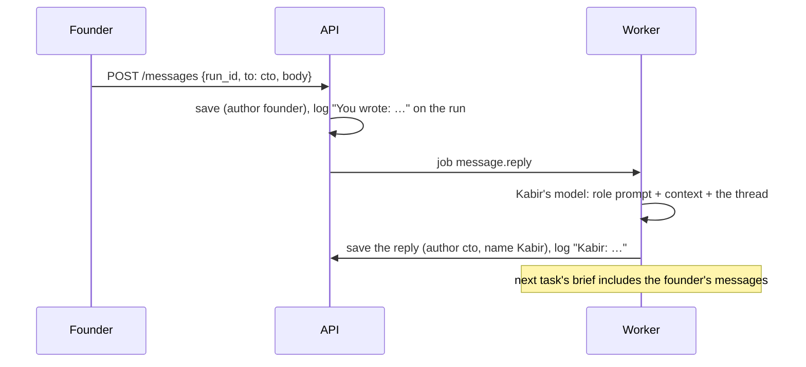

# Messages (talk to any agent)

**Status:** Built (Phase 3): the founder writes to an agent about a run or a project, the agent replies in role, and the messages reach the work; tried live Oct 5, 2026  
**Code:** `backend/app/features/messages/` · reply job `backend/app/workers/handlers/messages.py` · `frontend/src/features/messages/` · migration `0010_messages`  
**Last updated:** 2026-10-05

## What it is

The founder can message any agent (Kabir, Mira, Isha, Tara…) in a thread on a run or on a project, like messaging an employee.
- **The agent replies** a little later, as itself, from what it can see of the work.
- **The message also reaches the work:**
  - On a run, Kabir's plan and every developer brief from then on include it ("Messages from the founder (follow them)").
  - On a project, Mira's next backlog plan includes it.
- **A message doesn't change a step that's already running.** It reaches the next task, like a note left for the team.

## How it works

1. **Posting** (`MessageService.post`): the run or project must be the caller's company's (`ThreadOwner`, otherwise 404). It saves the message, logs `message.posted` on the run's activity, and queues `message.reply`.
2. **Replying** (`AgentReplier`, in the worker):
   - **Who answers:** the addressed role's persona (`personas()` in `wiring.py`: each role with instructions, first display name). It uses that role's own model (`role_model`).
   - **What it sees:** for a run, the request, its status and the latest 40 events (no tool or model noise). For a project, the goal, the backlog with statuses, open questions and the founder's answers. Plus the thread so far.
   - **How it answers:** 2–5 plain sentences, never claiming work that isn't in the context.
   - It saves the reply and logs it on the run. A retried job doesn't answer twice.
3. **Reaching the work:**
   - `MessageService.for_run` is the graph's `FounderNotes` (`build_app_graph(..., notes=)`), read by the `plan` node and at the start of every `develop` task.
   - `for_project` is the planner's `ProjectNotes`.
   - Only the founder's messages count as instructions, never the agents' replies.

## Code map

| File | Responsibility |
| --- | --- |
| `schemas.py` | `ThreadKind`, `NewMessage` (exactly one of `run_id` / `project_id`), `Message` |
| `models.py` · `repository.py` · `memory_repository.py` | The `messages` table |
| `interfaces.py` | `MessageRepository`, `ThreadOwner` |
| `owner.py` | `ServiceOwner`: ownership through the runs and projects services |
| `service.py` | `MessageService`: post, thread, recent, `for_run`, `for_project`; `REPLY_JOB` |
| `replier.py` | `AgentReplier`, `Persona`, `ThreadContext`, the reply prompt |
| `router.py` | `/messages` |
| `workers/handlers/messages.py` | `MessageReply` (the job), `TeamContext` |
| `workflows/nodes/develop.py` | `founder_notes()`, used by develop and plan |
| `frontend/…/messages/` | `MessageThread` (run and project pages), `MessageForm`, `MessageList` |

## API

| Method | Path | Purpose | Auth |
| --- | --- | --- | --- |
| POST | `/messages` | `{run_id or project_id, to (role id, default cto), body}` → 201 | Bearer, own thread |
| GET | `/messages?run_id=…` or `?project_id=…` | The thread, oldest first | Bearer, own thread |
| GET | `/messages/recent` | The company's latest messages, newest first | Bearer |

## Data model

`messages`: `id` (bigserial), `company_id` (FK companies), `thread` (`run` / `project`), `thread_id`, `author` (`founder` or a role id), `name`, `to`, `body`, `created_at`. Indexed by thread and by company.

## Events

`message.posted` (new type) on runs: from `founder` ("You wrote: …"), and from the replying agent's role ("Kabir: …", with its tokens).

## Dependencies

- **Uses:** `runs` and `projects` (ownership, context), `events`, `jobs`, `models` (the role's model), `auth`
- **Used by:** `workflows` (FounderNotes), `projects` planner (ProjectNotes), `inbox` (recent replies)

## Design decisions

- 2026-10-05 — **Messages steer the next task, not the current one.** Interrupting a model mid-step would waste the work in progress. A note for the next task is cheap and predictable.
- 2026-10-05 — **Replies come from the role's own model, in a background job**, so the API stays fast and the same role answers as works.
- 2026-10-05 — **Only the founder's words are instructions.** Agents' replies are shown, never fed back as orders.

## How to run and test

- `uv run pytest app/features/messages app/features/workflows/tests/test_build_app_graph.py::test_the_founders_messages_reach_the_plan_and_every_brief`
- Live: the Messages box on a run or project page (the worker must be running for replies).

## Known limitations and gotchas

- Replies come within about a minute (the job queue); the page doesn't update live yet, so refresh.
- A role without its own instructions (security, devops) is answered by the first persona (Mira).
- Live (Oct 5): Mira answered a project message in about 10 s, but skipped one of its two questions (free model).

## Troubleshooting

| Symptom | Likely cause | Fix |
| --- | --- | --- |
| No reply | The worker isn't running, or the model call failed | Start the worker; write again |
| 404 on posting | Not your run or project, or wrong id | Check the link |

## Changelog

| Date | Change |
| --- | --- |
| 2026-10-05 | Messages can be up to 10,000 characters (was 4,000) |
| 2026-10-05 | Created: threads on runs and projects, agent replies in role, founder's messages in the team's briefs and the PM's plan |
