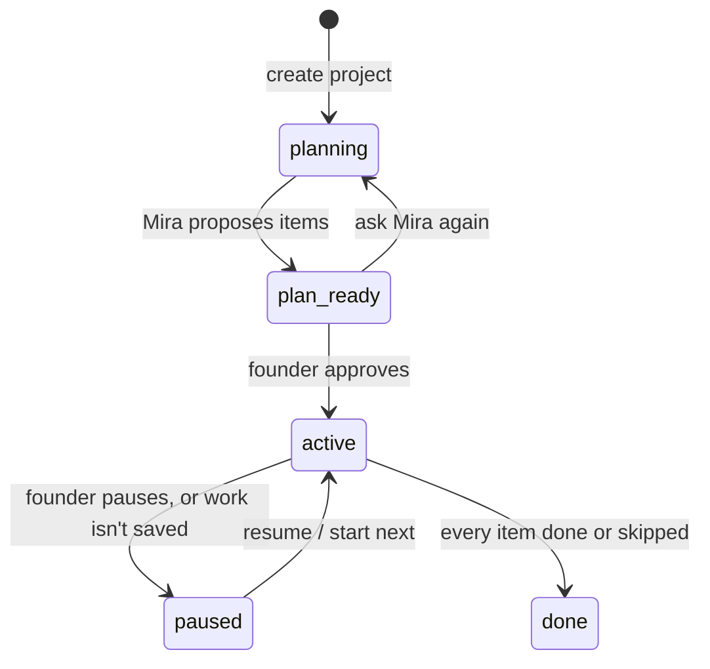

# Projects (projects and their backlog)

**Status:** Built (Phase 2, item 2): projects, the PM's backlog, items as runs, autopilot across days. Live-tested up to an item's run (Oct 4, 2026); an item released end to end live is still to do  
**Code:** `backend/app/features/projects/` · worker `backend/app/workers/handlers/backlog.py` · `frontend/src/features/projects/` · pages `frontend/src/app/admin/projects/` · migration `backend/alembic/versions/0006_projects_backlog.py`  
**Last updated:** 2026-10-04

## What it is

A run is one request. A **project** is the founder's app over weeks: a goal, a **backlog** of small items in order, and a team that works through it **day after day**. Interviewees said this is the gap: project management, a backlog, work that continues across days, and a standup (see [07-interview-findings.md](../../07-interview-findings.md)).

1. The founder creates a project: a name, the goal in their own words, and optionally their existing GitHub repository.
2. **Mira (the PM)** turns the goal into 3–12 items, each a working, testable slice with acceptance checks and a size, plus up to 3 assumptions or questions.
3. The founder edits, moves, adds or deletes items, then **approves the plan**. Nothing is built before that.
4. Each item becomes a normal **build run** (Kabir plans it, the developers build it, QA checks, the founder approves the release), one at a time, so every item builds on the last.
5. On **autopilot**, the worker starts the next item when the previous one is done, up to the project's **daily limit**, and stops at anything that needs the founder.

## How it works

Items: `proposed` → `todo` (approved) → `in_progress` (its run works or waits at the release gate) → `done`; or `waiting_for_merge` (a pull request on the founder's own repo) → `done` once merged; or `blocked` (rejected, failed, error) → `todo` (retry) or `skipped`.

### Planning (`planner.py`, `pm.py`)

- Creating a project, or **Ask Mira again**, queues a `backlog.plan` job. The worker calls the PM's model once with the `submit_backlog` tool (the PM role's `instructions` and `model` in the team template).
- The answer is read leniently (`pm.py`), like the CTO's plan: `name`/`item` for `title`, `acceptance_criteria` as a string, `small`/`large` sizes, plain strings, a JSON blob in the text, numbered lines. If nothing usable comes back, the goal becomes a single item.
- Re-planning replaces only items that haven't started (`proposed`, `todo`). Mira is told what's already built so she doesn't plan it again.
- It is logged like a run (`run_id` `plan-<project>-<4 hex>`): `run.started` (founder), `model.used` (PM, with tokens), `plan.created` (the titles and questions), `run.finished` with status `planned`. The standup lists it under Done: "Mira planned the backlog: N items".
- If planning keeps failing, the project is paused with "Mira couldn't plan the backlog: … Ask her again."

### Working through it (`progress.py`)

- **Start next** (button, `POST /projects/{id}/next`, or the tick): refuses while any item is in progress, waiting for a merge, or blocked (one item at a time, each building on the last). It starts a run whose request is the item (title, description, "Done when" checks), its place in the backlog, the project's goal and the items already built.
- **Where the work goes:**

| Project | First item | Later items |
| --- | --- | --- |
| New (no repository) | Its run creates a private repository named after the project (`pomodoro-focus-timer-1e1030`); the project remembers it (`repo_owned: true`) | Work in that repository; the pull request is **squash-merged automatically** once the founder approves at the release gate |
| The founder's repository | Pull request on a new branch | The item waits as `waiting_for_merge` ("Merge the pull request on GitHub to continue"); the tick checks GitHub and moves on once merged, or blocks if it was closed |

- **When a run ends**, the worker's build handlers call `on_run_finished` (`RunListener`): released → done (or waiting for merge); rejected, failed, error → blocked with a note. Released work that wasn't saved anywhere (no `GITHUB_TOKEN`) blocks the item and **pauses the project**, because the next item couldn't build on it.
- **The tick** (worker, once a minute, autopilot projects only): follows open pull requests, catches up items whose run finished but whose report was missed, then starts the next item if none is busy and fewer than `daily_limit` items started today (India time, `STANDUP_TIMEZONE`). When everything is done or skipped, the project is `done`.

## Code map

| File | Responsibility |
| --- | --- |
| `schemas.py` | `Project`, `ProjectDetail`, `BacklogItem`, `ItemFields`, `NewProject`, `ProjectUpdate`, `ItemUpdate`, statuses, `Size` |
| `models.py` | `ProjectRow`, `BacklogItemRow` |
| `interfaces.py` | `ProjectRepository`; `RunStarter` (RunService satisfies it); `PullRequests` (GitHubRepoHost satisfies it) |
| `repository.py` · `memory_repository.py` | Postgres and in-memory storage |
| `pm.py` | `submit_backlog` tool, `PM_PROMPT`, lenient `parse_backlog` |
| `planner.py` | `BacklogPlanner`: the PM's model call, proposed items, events |
| `service.py` | `ProjectService`: create, edit, approve, pause/resume, add/edit/move/delete/skip/retry items; queues `backlog.plan` |
| `progress.py` | `BacklogProgress`: `start_next`, `on_run_finished`, `tick`; `item_request()` |
| `router.py` · `dependencies.py` · `exceptions.py` | API |
| `app/workers/handlers/backlog.py` | `PlanBacklog` job, `backlog_schedule` (the tick) |
| `app/workers/handlers/build.py` | `RunListener`: build handlers report finished runs |
| `repos/github.py` | `pull_request_state`, `merge_pull_request` (squash) |
| `frontend/…/projects/` | `ProjectsOverview`, `NewProjectForm`, `ProjectPage`, `BacklogItemRow`, `ActionButton`, `AutopilotForm`, `AddItemForm`; server actions in `api/actions.ts` |

## API

| Method | Path | Purpose |
| --- | --- | --- |
| POST | `/projects` | Create (`name`, `goal`, optional `repo`, `test_command`, `stack` for a new project, `autopilot`, `daily_limit` 1–10) → 202; planning starts |
| GET | `/projects` · `/projects/{id}` | List (newest first) · one project with its backlog |
| PATCH | `/projects/{id}` | Name, goal, test command, autopilot, daily limit |
| POST | `/projects/{id}/plan` · `/plan/approve` | Ask Mira again · approve the proposed items |
| POST | `/projects/{id}/pause` · `/resume` · `/next` | Pause · resume · start the next item now |
| POST | `/projects/{id}/items` | Add an item at the end (proposed until the plan is approved) |
| PATCH · DELETE | `/projects/{id}/items/{item_id}` | Edit or move (`position`) · delete (only not-started items) |
| POST | `/projects/{id}/items/{item_id}/skip` · `/retry` | Skip · retry a blocked item |

Errors: 404 `project_not_found`, `backlog_item_not_found`; 409 `backlog_conflict` (e.g. starting while an item is busy, editing started work, approving without a plan). No sign-in yet.

## Data model

| Table | Key columns | Notes |
| --- | --- | --- |
| `projects` | `id`, `name`, `goal`, `repo` (jsonb), `repo_owned`, `test_command`, `stack` (jsonb, migration `0008`), `status`, `autopilot`, `daily_limit`, `questions` (jsonb), `error`, `company_id` (nullable) | |
| `backlog_items` | `id`, `project_id` (FK, cascade), `position`, `title`, `description`, `acceptance` (jsonb), `size`, `status`, `run_id`, `attempts`, `note`, `pull_request_url`, `started_at`, `done_at` | Indexes `(project_id, position)` and `run_id` |

## Events

Planning: `run.started`, `model.used` (PM), `plan.created`, `run.finished` (`status: planned`). Each item's run records the usual run events.

## Dependencies

- **Other features used:** `runs` (`RunStarter`), `repos` (`RepoSource`, `PullRequests`, `repo_name_for`), `events`, `jobs`, `models`
- **Used by:** the worker (planning job, tick, build-handler listener), `standups` (the `planned` status)
- **Config:** `GITHUB_TOKEN` (repositories, pull requests, merges), `STANDUP_TIMEZONE` (the daily limit's day), the PM role in the team template

## Design decisions

- 2026-10-04 — **One item at a time, each a normal run.** Every item builds on the last in the same repository; no parallel branches to merge. The release gate stays per item.
- 2026-10-04 — **The founder approves the plan before anything is built**, and can edit it freely; started work can't be edited, only skipped or retried.
- 2026-10-04 — **Work carries over through the repository.** MedhKarm-created repositories merge approved pull requests on their own (approval is the release); on the founder's repository the backlog waits for their merge, so nothing lands in their main branch without them.
- 2026-10-04 — **Autopilot stops at anything that needs the founder** (a blocked item, a pull request to merge, the daily limit), and a missed report is caught up from the run itself.
- 2026-10-04 — Planning is logged like a run, so its cost is counted and the standup shows it.
- 2026-10-04 — Mira is told never to plan separate "testing" items: in the first live plan she proposed two, a technical layer rather than a slice.

## How to run and test

- Tests: `uv run pytest app/features/projects tests/test_backlog_jobs.py tests/test_build_jobs.py` (parsing, editing rules, planning, progress across items and days with fake runs and pull requests, the API, the worker jobs). Frontend: `npm test` (`describe`, `parseForms`).
- Live: API, worker and frontend running, then http://localhost:3000/admin/projects.

**Live test, Oct 4, 2026** ("Pomodoro focus timer", gpt-oss:20b): Mira planned 9 items with two good questions (how "end of day" works; time added while paused). Two items were "unit tests" layers, so the founder deleted them on the page (and the prompt now forbids them). The plan was approved and item 1 started as a run. The developer then hit a test-import error, eventually wrote a `sitecustomize.py` shim, and QA's fake-test guard failed the run. The item was blocked with "Retry or skip it", the project stayed active, and no repository was created. The backlog behaved as designed; the team's failure is the free model's ceiling (see [09-gate-1-report.md](../../09-gate-1-report.md)).

## Known limitations and gotchas

- Mira doesn't read an existing repository's code when planning (the CTO does, per item); plans for existing projects are based on the goal.
- No clarifying conversation yet: Mira lists assumptions and questions; the founder answers by editing items or the goal and asking again.
- One project's items run one at a time; different projects run in parallel (up to the worker's concurrency).
- `daily_limit` counts items started, not tokens; a token budget per project comes with paid models.
- The founder's own repository: a pull request merged with conflicts against later work is the founder's to resolve.

## Troubleshooting

| Symptom | Likely cause | Fix |
| --- | --- | --- |
| Stays "Mira is planning" | No worker running | `uv run python -m app.workers.main` |
| Autopilot doesn't start items | An item is blocked or waiting for a merge, today's limit is used, or the project is paused | Check the backlog; retry/skip, merge, or "Start next item now" |
| Project paused: "wasn't saved to a repository" | No `GITHUB_TOKEN` | Set it, then retry the item |
| Item stuck "Merge on GitHub" | The pull request isn't merged yet (founder's repository) | Merge it; the tick moves on within a minute |

## Changelog

| Date | Change |
| --- | --- |
| 2026-10-05 | Sign-in: projects carry `company_id`; every route needs a signed-in founder, and project routes check it's theirs; item runs start in the project's company; a cancelled item's run blocks the item ("You cancelled it. Retry or skip it.") |
| 2026-10-05 | Tested live end to end: "Tip splitter" (6 items planned by Mira with 3 questions); item 1 released into the new private repo `tip-splitter-ec7529`; item 2 cloned it, built on it, passed QA and security, opened PR #1, which merged automatically on approval |
| 2026-10-05 | `stack` (the founder's stack choices): passed to every item's run, so the first one starts from the starter; Mira's planning brief includes it ("plan features, not set-up"); stack fields on the new-project form |
| 2026-10-04 | Created: projects, the PM's backlog, editing and approval, items as runs, autopilot with a daily limit, pull-request merges and following, admin pages |
