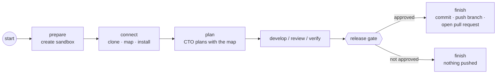

# Repos (founders' existing projects)

**Status:** In progress (Phase 2, item 1): clone a GitHub repository, map it before planning, open a pull request on release; or, for a new project, create a private repository on release. Live-tested on a public repository; pull requests not yet tested against GitHub  
**Code:** `backend/app/features/repos/` · used by `workflows` (`nodes/connect.py`, `nodes/finish.py`) · form fields in `frontend/src/features/runs/` · migration `backend/alembic/versions/0004_run_repos.py`  
**Last updated:** 2026-10-01

## What it is

Most solo builders want the AI team to work on the project they already have, not start a new one. With this feature a run can point at a GitHub repository. The team clones it into the sandbox and **maps it before anyone plans or writes code**: files, languages, a code outline, the README, and how to install and test it. The CTO plans with that map and the developers work with it. When the founder approves the release, the work goes back to the repository as a **pull request** on a new branch. Nothing is ever pushed to the founder's own branches.

## How it works



1. **Start** a run with a `repo` (`{"url": "https://github.com/owner/name", "branch": null}`). The test command is optional: without one, it's detected from the project.
2. **connect** (new graph node, after `prepare`):
   - clones the repository into the empty workspace (shallow, 50 commits; the given branch or the default one). If the workspace already has a checkout (a retry after a crash), it isn't cloned again;
   - adds `node_modules/`, `__pycache__/`, `*.pyc`, `.pytest_cache/`, `.venv/` to `.git/info/exclude`, so installs and test runs never end up in the pull request;
   - **maps** the code (`mapper.py`, no model call): tracked files (`git ls-files`, so `.gitignore` is respected), languages, `package.json` / `pyproject.toml` / `requirements*.txt` summaries, top-level definitions per file (Python `def`/`class`, JS/TS `function`/`class`/exported `const`/`type`…), and the first 30 lines of the README;
   - **detects** how to install and test it (table below) and runs the install once (up to 10 minutes). A failed install doesn't stop the run: it's added to the map so the CTO and developers know;
   - stores the map as text in the run's state (`codebase_map`, at most 6,000 characters) and records a `codebase.mapped` event.
3. **plan**: the CTO gets the map and is told to change the existing project and keep its structure and style.
4. **develop**: every developer brief starts with the map.
5. **finish**, if the founder approved: commits the work (author `MedhKarm`) to `medhkarm/<run_id>`, pushes it and opens a pull request against the branch the run started from (or the default branch). The pull request's title is the request's first line; its body has the developer's summary and the full request. A `changes.delivered` event (DevOps) carries the link, and the run's `delivery` field shows it in the admin page. Then the sandbox is removed. If the push or the pull request fails, the job is retried with the sandbox still there; a retry reuses the commit and an already-open pull request.

### New projects: a repository of their own

A run without a repository creates one when its work is released (unless the founder opts out: `create_repo: false` in the API, the checkbox on the admin form, `--no-new-repo` on the command line):

1. `finish` turns the workspace into a git repository (`git init -b main`, the same local-only excludes) and commits the work.
2. It creates a **private** repository in the token owner's account, named by the founder (`new_repo_name`) or from the request plus the run id (`roman-numerals-converter-3f9a2c`), with the request's first line as its description.
3. It pushes the work to `main`, never with `--force`: an existing repository with other work is left alone and the delivery fails with a clear error. A retry finds the repository the first try created and pushes the same commit again.
4. `changes.delivered` says "Created the repository and pushed the work: <url>"; the run's `delivery` has `status: created` and `repo_url`.

The eval runner never asks for a repository, so evals create nothing.

Live test (Oct 2, 2026): a temperature-conversion module, approved at the gate, became the private repository `pavanrajkg04/create-temperature-py-with-c-to-f-c-f-to-be9527` with its two files on `main` (checked on GitHub). An earlier run (bill splitting) failed QA, its own test and code disagreeing on the rounding rule, and so created nothing.

The map is also built for runs without a repository when the workspace has files (the eval runner's starting projects), so evals measure the same behaviour. Installing only happens for cloned repositories.

### Code graph (experiment, `CODE_GRAPH=true`)

With [Graphify](https://github.com/Graphify-Labs/graphify) (`graphifyy` 0.9.73, Apache-2.0/MIT, in the sandbox image), the map also lists the project's **most connected code**: the 10 classes and functions with the most links (calls, imports, uses, methods), each with its file, line and methods with their lines. Tests and file nodes are left out. Graphify parses code with tree-sitter (`graphify extract . --code-only`): no model calls, about half a second for itsdangerous (232 nodes, 531 links). Developers also get `explain_symbol` ([developer_engine.md](developer_engine.md)).

Graphify writes `graphify-out/` into the project; we move it to `/tmp/medhkarm-graph/` straight away (`app/shared/code_graph.py`), so it never counts as a changed file. `graphify-out/` is also in `.git/info/exclude` and skipped by the map, in case a run stops in between.

It's off by default until the A/B comparison on the eval suite and a repo task shows it helps.

### What gets detected

| Project has | Install (once) | Tests |
| --- | --- | --- |
| `package.json` with dependencies | `npm ci` with `package-lock.json`, else `npm install`; `pnpm`/`yarn` via corepack when their lockfile is there | `npm test` (or `pnpm`/`yarn test`) if there's a real `test` script |
| `pyproject.toml` with `[build-system]` | `pip install -e .` (src layouts only import once installed) | |
| `pyproject.toml` without a build system | `pip install` its dependencies | |
| Dependency groups / extras named `test`, `tests`, `testing`, `dev` | `pip install` those packages | |
| `requirements.txt`, `requirements-dev.txt` | `pip install -r` each | |
| Python test files (`test_*.py`, `*_test.py`) | | `python -m pytest -q` |
| No tests at all | | the main language's runner: `python -m pytest -q` or `node --test` (the developers add tests) |

Several commands are joined with `&&`. A test command given by the founder always wins.

## Security

- The GitHub token never touches the disk inside the sandbox. git gets it as a one-off `-c http.extraHeader=...` on the clone and push commands, so it's not in `.git/config`, where code the agents write and run could read it. It's scrubbed (plain and base64) from any error we keep.
- Repository addresses must be `https://github.com/<owner>/<name>`; branch names are checked (letters, digits, `. _ - /`, no `..`, no leading `-`) and every value is shell-quoted.
- The team only pushes to its own `medhkarm/<run_id>` branch (with `--force`, which only ever overwrites its own earlier attempt) and never merges: the founder merges the pull request.
- Without `GITHUB_TOKEN`, public repositories still clone; delivery is skipped with the reason "No GITHUB_TOKEN set".

## Code map

| File | Responsibility |
| --- | --- |
| `schemas.py` | `RepoSource` (validated GitHub address and branch; `owner`, `name`), `NewRepo` and `repo_name_for()`, `CodebaseMap` (+ `brief()` for prompts), `Delivery`, `DeliveryStatus` |
| `interfaces.py` | `RepoHost` Protocol: `clone`, `deliver` (GitLab or Bitbucket would be new classes); `CodeGraph` Protocol: `describe` |
| `github.py` | `GitHubRepoHost`: clone, commit, push, open or reuse the pull request; `publish()` creates a private repository and pushes `main` (GitHub REST API via `httpx`) |
| `code_graph.py` | `GraphifyCodeGraph`: the "most connected code" part of the map (`hubs()`), from Graphify's `graph.json` |
| `mapper.py` | `map_codebase(sandbox)`: the map and the install/test commands |
| `service.py` | `RepoService`: `checkout()` (clone once, map, install) and `deliver()` (branch name, title, body). What the workflow uses |
| `exceptions.py` | `RepoError` (clone, push or pull request failed) |
| `tests/fakes.py` | A sandbox that answers the mapper's commands from in-memory files; `FakeHost` |
| `workflows/nodes/connect.py` | Graph node: checkout, map, test command |
| `workflows/nodes/finish.py` | Delivers released work before removing the sandbox |

## API

No endpoints of its own. `POST /runs` takes an optional `repo`, and runs carry `repo` and `delivery` ([runs.md](runs.md)):

```bash
curl -X POST 127.0.0.1:8000/runs -H 'content-type: application/json' -d '{
  "request": "Add a /health endpoint with a test",
  "repo": {"url": "https://github.com/you/your-api", "branch": "main"}
}'
```

Command line: `uv run python -m app.workers.build_run start --repo https://github.com/owner/name [--branch dev] --request "..."` (the test command is then optional).

## Data model

Columns on `runs`: `repo` (jsonb, `RepoSource`) and `delivery` (jsonb, `Delivery`: `status` opened / created / no_changes / skipped, `branch`, `commit`, `pull_request_url`, `repo_url`, `reason`), migration `0004_run_repos`; `new_repo` (jsonb, `NewRepo`: the repository to create on release, null for none), migration `0005_run_new_repo`. The workflow state gains `repo`, `repo_commit`, `codebase_map`, `setup_ok` and `delivery`.

## Events

| Type | Actor | When |
| --- | --- | --- |
| `codebase.mapped` | `cto` | After `connect`, when the workspace has files. Data: `map`, `commit`, `test_command`, `setup_ok` |
| `changes.delivered` | `devops` | On a released repo run. Summary "Opened a pull request: <url>" or "Didn't open a pull request: <reason>"; data is the `Delivery` |

## Dependencies

- **Other features used:** `sandbox` (interfaces)
- **Used by:** `workflows` (through `RepoService`), `runs` (`RepoSource`)
- **External services:** GitHub (git over HTTPS, REST API)
- **Config:** `CODE_GRAPH` (default `false`): the code graph in the map and `explain_symbol`. `GITHUB_TOKEN`: a personal access token. For existing repositories: fine-grained, with **Contents** and **Pull requests** read and write, on those repositories. To create repositories for new projects it also needs to create repositories: a classic token with the `repo` scope, or a fine-grained token with **Administration** read and write on all repositories (which also allows deleting them: keep it private). Wired in `app/workers/wiring.py`

## Design decisions

- 2026-10-01 — The map is built with shell commands, not a model: it's free, fast (the clone, install and map of a 40-file library took 9 s) and the same every time. Agents can still read any file with their tools.
- 2026-10-01 — Map first, then plan: on Gate 1 the developers spent many steps re-reading the project; the map gives the CTO and every developer the layout up front.
- 2026-10-01 — New projects get a private repository on release, not at the start: only approved work leaves the sandbox, and rejected runs leave nothing behind on GitHub. Pushing straight to `main` is fine there because the founder approved this exact work and the repository is new.
- 2026-10-01 — A pull request, never a direct push: the founder reviews and merges on GitHub as with any contributor. Matches "the founder approves what matters".
- 2026-10-01 — Delivery happens in `finish`, before the sandbox is removed, and is safe to repeat, so a failed push is retried with the work still there.
- 2026-10-01 — Token by environment variable for now (one founder, local). GitHub App installation tokens per company come with sign-in.
- 2026-10-01 — Graphify behind a `CodeGraph` interface and a switch, not a replacement: our grep map stays (it needs nothing in the image), and the graph must earn its place on the eval suite. Code-only mode, so no model calls or API keys. It's third-party code that runs inside every sandbox, so its version is pinned and it only ever sees the sandbox's workspace.
- 2026-10-01 — Install only for cloned repositories: the eval projects run in an image that already has their tools.

## How to run and test

- Unit tests (fakes, no Docker, no network): `uv run pytest app/features/repos app/features/workflows`
- Live: start a run with `--repo` (see API above). Without `GITHUB_TOKEN` it runs on public repositories and skips the pull request.

## Known limitations and gotchas

- GitHub only, over HTTPS. JS/TS and Python projects are detected; other languages get a map but no install or test command.
- One token for every run. Private repositories need the token to have access.
- Shallow clone (50 commits): enough to work and push a branch, not for history-heavy tasks.
- The pull request isn't updated if the founder asks for changes later; each run opens its own.
- The sandbox needs network access to clone and install (the default for the built-in engine's Docker sandbox).
- Monorepos: only root-level manifests are read.

### Live test (Oct 1, 2026)

`pallets/itsdangerous` (40 files, 297 tests), request: add `Serializer.peek()` with tests, gpt-oss:20b. Clone, install and map: 9 s. The CTO planned 2 tasks with the map. The developer used all 25 steps on both tasks reading files (`sed`, `grep`) and **wrote nothing**. The CTO approved anyway, and QA's checks passed, because the existing tests pass untouched. The run asked for approval with no changes (353,839 tokens). Fixed the same day: the review sends back work that changed no files, and QA fails a run with no changes ([workflows.md](workflows.md)). The step limit on a real library is the Gate 1 finding again: the free model runs out of steps reading before it writes.

Rerun 2 (with `search`, numbered partial reads, 40 steps): the developer wrote code, but replaced the whole 400-line `serializer.py` with a fragment using `write_file`, so nothing imported. Failed at QA (835,497 tokens). Fix: `edit_file` and a `write_file` guard ([developer_engine.md](developer_engine.md)).

Rerun 3 (with `edit_file`): reached the release gate with a correct `peek()` added to `serializer.py` (checked by hand: plain and URL-safe tokens decode, a tampered signature is ignored, garbage raises `BadPayload`) and all 297 existing tests passing, in 415,514 tokens. Still short of the request: **no tests were added**, and the CTO approved without them. The CTO's planning call also hit a model error, so the run fell back to one task covering the whole request.

## Troubleshooting

| Symptom | Likely cause | Fix |
| --- | --- | --- |
| `Couldn't clone …: Repository not found` | Private repository and no token, or the token can't see it | Set `GITHUB_TOKEN` with access to that repository |
| `GitHub didn't create the repository … (403)` | Token can't create repositories | Classic token with `repo`, or fine-grained with Administration read and write |
| `Couldn't push to https://github.com/you/<name>` on a new project | A repository with that name already has other work | Choose another `new_repo_name` |
| `Didn't deliver to GitHub: No GITHUB_TOKEN set` | No token | Set `GITHUB_TOKEN`; the work of that run is gone with its sandbox |
| `Couldn't push …: 403` | Token lacks Contents write | Give the token Contents read and write |
| `GitHub didn't open the pull request (403)` | Token lacks Pull requests write | Give the token Pull requests read and write |
| Map says "Installing dependencies … failed" | Native build tools, private packages, or a lockfile out of date | Give a test command that installs what's needed, e.g. `pip install -q x && python -m pytest -q` |

## Changelog

| Date | Change |
| --- | --- |
| 2026-10-01 | New projects: a private repository created on release (`create_repo`, `new_repo_name`; `new_repo` on runs, migration `0005`) |
| 2026-10-01 | Code graph experiment (`CODE_GRAPH`): Graphify's most connected code in the map; `graphify-out/` kept out of the workspace and pull requests |
| 2026-10-01 | Live test on `pallets/itsdangerous`; no-changes guard added in the workflow |
| 2026-10-01 | Created: GitHub clone, codebase map before planning, install/test detection, pull request on release |
