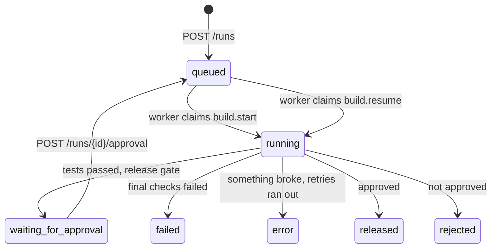

# Runs (build runs over HTTP)

**Status:** Done (Phase 1, step 5): start, list, get and approve runs over HTTP  
**Code:** `backend/app/features/runs/` · migration `backend/alembic/versions/0003_jobs_and_runs.py` · no frontend yet (comes with the admin page)  
**Last updated:** 2026-10-01

## What it is

The founder's handle on a build: ask for something, see where it stands, and approve or reject the release. Each call returns at once, because the work happens in background workers ([jobs.md](jobs.md)). Progress arrives through the activity log (`/runs/{run_id}/events` and its live stream, [events.md](events.md)). This replaces the command line (`build_run`) as the way runs start and get approved.

## How it works



1. `POST /runs` with the request and test command → a `runs` row (`queued`) and a `build.start` job. The answer is the run, with its id.
2. A worker runs the graph and keeps the row's `status` up to date. At the release gate it stores what the founder is asked (`gate`: summary, files changed, test output) and sets `waiting_for_approval`.
3. `POST /runs/{id}/approval` with `approved` and optional `feedback`. This moves the run from `waiting_for_approval` to `queued` in one conditional update, so a double click or two people approving at once queues only one decision (the other gets 409), and queues a `build.resume` job.
4. A worker resumes the graph with the decision and sets `released` or `rejected`.

## Code map

| File | Responsibility |
| --- | --- |
| `schemas.py` | `Run`, `RunStatus`, `StartRun`, `ApprovalDecision` |
| `interfaces.py` | `RunRepository` Protocol |
| `models.py` | `RunRow`: the `runs` table |
| `repository.py` | `SqlRunRepository` |
| `memory_repository.py` | `InMemoryRunRepository`: tests |
| `service.py` | `RunService`: start (row + job), decide (guarded), get, list, `set_status` for workers; job kind names `START_JOB`, `RESUME_JOB` |
| `exceptions.py` | `RunNotFoundError` (404), `RunNotWaitingError` (409) |
| `dependencies.py`, `router.py` | API |

## API

| Method | Path | Purpose | Auth |
| --- | --- | --- | --- |
| POST | `/runs` | Start a run: `{"request": "...", "test_command": "pytest -q"}` → 202 with the run | None yet |
| GET | `/runs?limit=50` | Runs, newest first (limit 1–200) | None yet |
| GET | `/runs/{run_id}` | One run: status, `gate` while waiting, `error` if it broke | None yet |
| POST | `/runs/{run_id}/approval` | `{"approved": true, "feedback": ""}` → 202 | None yet |

Errors: 404 `run_not_found`; 409 `run_not_waiting_for_approval`; 422 for an empty or over-long request. The activity log for a run stays at `/runs/{run_id}/events` (events feature).

```bash
curl -X POST 127.0.0.1:8000/runs -H 'content-type: application/json' \
  -d '{"request": "Create greet.py with greet(name) and pytest tests", "test_command": "python -m pytest -q"}'
curl 127.0.0.1:8000/runs/<run_id>
curl -X POST 127.0.0.1:8000/runs/<run_id>/approval -H 'content-type: application/json' -d '{"approved": true}'
```

## Data model

| Table | Key columns | Notes |
| --- | --- | --- |
| `runs` | `id` (same as the LangGraph thread id and the events' `run_id`), `request`, `test_command`, `status`, `gate` (jsonb), `error`, `created_at`, `updated_at`, `company_id` (nullable) | Index on `created_at`. The detail of a run lives in the event log and the checkpoint; this row is its current status, for lists and approvals |

## Events

None of its own. The workflow records the run's events ([workflows.md](workflows.md)).

## Dependencies

- **Other features used:** `jobs` (through the `JobQueue` interface)
- **Used by:** the worker's build handlers (status updates)
- **External services:** Postgres
- **Config:** `BUILD_MAX_ATTEMPTS`

## Design decisions

- 2026-10-01 — A `runs` table, although the checkpoint and the event log hold everything: listing runs and checking "is it waiting?" must not mean opening LangGraph checkpoints, and the API stays free of LangGraph.
- 2026-10-01 — Approval is a guarded status change (`waiting_for_approval` → `queued`) plus a job with a unique key, so one decision wins.
- 2026-10-01 — The founder's request and test command go into the row, not only the job, so a retry or another worker always has them.

## How to run and test

- Run the API and a worker (see [jobs.md](jobs.md)), then use the `curl` lines above.
- Tests: `uv run pytest app/features/runs tests/test_build_jobs.py`; database: `uv run pytest -m integration app/features/runs`.

## Known limitations and gotchas

- No sign-in or companies yet: anyone who can reach the API can start and approve runs. Keep it on localhost until auth lands.
- The default test command `pytest -q` needs pytest in the sandbox image. The default `python:3.13-slim` doesn't have it, so either use `medhkarm-sandbox:dev` (`SANDBOX_IMAGE`) or put `pip install -q pytest` in the test command.
- Cancelling a running build isn't supported yet.
- Runs started from the command line (`build_run start`) have no `runs` row, so they don't appear in `GET /runs` (their events and standup still work).

## Troubleshooting

| Symptom | Likely cause | Fix |
| --- | --- | --- |
| Stays `queued` | No worker running | `uv run python -m app.workers.main` |
| `error` | Retries ran out (model or sandbox kept failing) | `error` on the run; `last_error` on its job |
| 409 on approval | Already decided, or not at the gate yet | `GET /runs/{id}` for its status |

## Changelog

| Date | Change |
| --- | --- |
| 2026-10-01 | Created: runs table, start/list/get/approve API, statuses kept up to date by workers |
