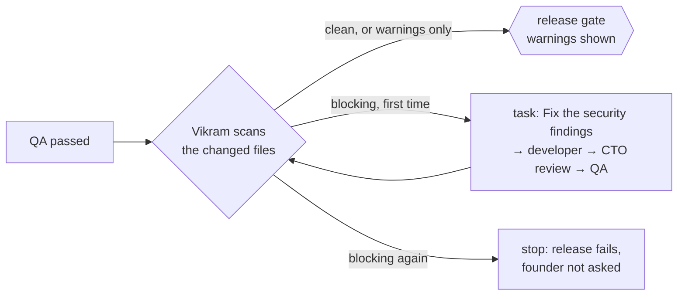

# Security (the security engineer, Vikram)

**Status:** Done (Phase 2): secrets, dangerous-code and dependency scans on every release, with one fix round  
**Code:** `backend/app/features/security/` · workflow step `backend/app/features/workflows/nodes/security.py` · rules `backend/sandbox-image/semgrep.yml` (in the image at `/opt/medhkarm/semgrep.yml`)  
**Last updated:** 2026-10-04

## What it is

Solo founders ship to real users, so a leaked API key or an injectable SQL query costs them. **Vikram**, the security engineer, checks every release **after QA passes and before the founder's release gate**. Problems he can block on go back to a developer to fix, once; the founder only ever sees scanned work, plus any warnings worth knowing. It costs nothing: no model calls, offline tools (dependency audits use the network).

## How it works

1. **What's scanned:** only the files the run changed (`dev_result.files_changed`), so a founder's existing code isn't blamed for old problems.
2. **Scanners** (`SecurityReview`, one after another; a scanner that breaks becomes a note, never a failed run):

| Scanner | Checks | Severity |
| --- | --- | --- |
| `secrets` (Python, in the worker) | Private keys, AWS/GitHub/OpenAI/Anthropic/Google/Slack/live Stripe/live Razorpay keys; `api_key`/`secret`/`token`/`password` set to a random-looking string (entropy ≥ 3.5); committed `.env`, `id_rsa` files. Placeholders (`your_…`, `example`, `test`, `xxx`, `${…}`) are ignored | critical / high |
| `semgrep` (in the sandbox) | 15 offline rules for Python and JS/TS: `eval`/`exec`/`new Function`, `shell=True`, shell commands from template strings, SQL built from strings, `yaml.load`, TLS checks off (blocking); `os.system`, pickle, debug servers, MD5/SHA-1, `mktemp`, `innerHTML`/`dangerouslySetInnerHTML` (warnings) | ERROR → high, WARNING → medium |
| `dependencies` (in the sandbox) | Only when the run changed `requirements*.txt` (`pip-audit`) or `package.json`/`package-lock.json` with a lockfile (`npm audit`) | vulnerable with a fix available → high; otherwise medium (npm: as reported) |

3. **Blocking** = high or critical. The first time, a task **"Fix the security findings"** is added for the first developer, with every blocking finding and how to fix it as its description. It goes through the normal loop (develop → CTO review → QA → Vikram again). If blocking problems remain after that round, the run ends as `failed` and the founder isn't asked to approve it.
4. **Warnings** (medium) don't block. The approval fact `security_warnings` feeds the software team's rule "The security engineer has warnings for you to look at", and the gate lists them (`gate.security`), as does the admin page's approval panel.
5. **The activity log** shows Vikram (`actor: security`): `security.finished` ("No security problems found", "Found 1 security problem: sent to Isha to fix", "Stopped the release: 1 security problem still there") with the findings in `data`, and a `task.assigned` for the fix task.

## Code map

| File | Responsibility |
| --- | --- |
| `schemas.py` | `Finding`, `Severity`, `ScanResult`, `SecurityReport` (`blocking`, `warnings`, `brief()`) |
| `interfaces.py` | `Scanner` Protocol |
| `scanners/secrets.py` | `SecretsScanner`, `find_secrets`, `entropy` |
| `scanners/semgrep.py` | `SemgrepScanner`, `parse_semgrep` |
| `scanners/dependencies.py` | `DependencyScanner`, `parse_pip_audit`, `parse_npm_audit` |
| `service.py` | `SecurityReview`, `default_scanners()` |
| `workflows/nodes/security.py` | The step: scan, fix task (`sec1`), `after_security` routing |
| `workflows/activity.py` | `security.finished` and the fix task's `task.assigned` |
| `sandbox-image/semgrep.yml` · `Dockerfile` | Our rules; Semgrep 1.179.0 and pip-audit 2.10.1 in `medhkarm-sandbox:3` |

## API

None of its own. Findings appear in the run's events and, for warnings, in `GET /runs/{id}` → `gate.security`.

## Data model

None: the report is in the run's checkpoint (`state.security`, `security_rounds`, `security_passed`) and the activity log.

## Events

`security.finished` (new type) and `task.assigned` from the new actor `security`.

## Dependencies

- **Used by:** `workflows` (the step), wired in `app/workers/wiring.py` when the team template has an **active `security` role**; without one, the step passes everything through
- **Tools:** the sandbox image `medhkarm-sandbox:3` (built automatically if missing); without Semgrep or pip-audit in a sandbox (e.g. the OpenHands image), those scanners add a note and the secrets scan still runs
- **Config:** the `security` role in the team template; the `security_warnings` approval fact and rule

## Design decisions

- 2026-10-04 — **After QA, before the founder.** Scanning broken code is wasted; the founder only sees work that passes tests and security.
- 2026-10-04 — **One fix round, then stop.** Mirrors the CTO's one revision; caps cost and never sends known-insecure work to the founder.
- 2026-10-04 — **Changed files only**, so existing projects aren't blocked by problems the team didn't introduce. A full-project audit for onboarding can come later.
- 2026-10-04 — **Our own offline Semgrep rules** instead of the registry (`--config auto` needs the network and returns hundreds of rules): 15 rules chosen for what solo founders' apps get wrong, each with a plain message and a fix. Validated with Semgrep: 18 of 18 problems caught in a test file and no false alarms on the safe versions (including `/regex/.exec()` and parameterised SQL).
- 2026-10-04 — No model in this role yet: deterministic tools first. A model can later explain findings or triage false positives.
- 2026-10-04 — The sandbox image tag moved to `medhkarm-sandbox:2`, so every machine builds the image with the scanners automatically.

## How to run and test

- Unit tests: `uv run pytest app/features/security app/features/workflows/tests/test_security_step.py`
- Rules in a real sandbox: `uv run pytest -m integration app/features/security`
- Rules by hand: `docker run --rm -v "$PWD":/workspace medhkarm-sandbox:3 semgrep scan --config /opt/medhkarm/semgrep.yml --metrics=off .`
- **Live test (Oct 4, 2026, gpt-oss:20b):** a backup helper requested "with `shell=True` for simplicity". QA passed it. Vikram found `py-shell-true` at `backup.py:60` and sent "Fix the security findings" to Isha. She rewrote it as `subprocess.run(cmd, ...)` with an argument list, Kabir approved, QA passed, and Vikram's second scan was clean. The run then waited at the gate.

## Known limitations and gotchas

- Rules cover common mistakes in Python and JS/TS, not everything; Semgrep's large registry or a model reviewer can be added later.
- JavaScript inside `.html` files isn't scanned by Semgrep (only `.js`/`.ts`/`.jsx`/`.tsx`/`.mjs`/`.cjs` files); secrets in them are. Seen in the specialties live test (a page script).
- Secrets in non-text files and in git history aren't checked.
- Dependency audits need the network and a lockfile for npm.
- Supabase access-rule checks (row-level security) come with Supabase projects.

## Troubleshooting

| Symptom | Likely cause | Fix |
| --- | --- | --- |
| Note "Semgrep or its rules aren't in this sandbox" | An old image, or the OpenHands sandbox | Use `medhkarm-sandbox:3` (`SANDBOX_IMAGE`) |
| A false alarm blocks a release | A rule too strict for the case | Adjust `sandbox-image/semgrep.yml` (rebuild the image with a new tag) |
| No Vikram events at all | The team template has no active `security` role | Check `teams/templates/software.toml` |

## Changelog

| Date | Change |
| --- | --- |
| 2026-10-04 | Created: secrets, Semgrep (15 offline rules) and dependency scans after QA; one fix round; warnings at the gate; image `medhkarm-sandbox:2` |
