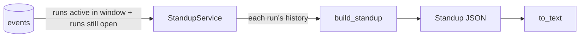

# Standups (daily standup)

**Status:** Done (Phase 1, steps 4–5): on request by API and command line, and sent every morning by the worker (to its log until email and WhatsApp)  
**Code:** `backend/app/features/standups/` · `backend/app/workers/standup.py` · `frontend/src/features/standups/` (page `/admin/standup`)  
**Last updated:** 2026-10-01

## What it is

The founder's morning summary, like a real team's standup: **what needs you, what was done, what's planned today, and what's blocked**. It is worked out from the activity log ([events.md](events.md)), so it describes exactly what the agents did. No model is called, so it costs nothing and gives the same answer every time. Interviewees asked for this specifically (a standup every morning, "like me managing a real company", see [07-interview-findings.md](../../07-interview-findings.md)).

Example from the real log on 1 Oct 2026 (shortened, with task titles tidied):

```
Standup for Fri 02 Oct 2026
01 Oct 09:00 to 01 Oct 17:55 (Asia/Kolkata)

5 tasks done, nothing blocked.

Needs you:
  Nothing

Done:
  Create calc.py with add(a, b) and divide(a, b)…
    - Released
  Build an expense tracker module in Python
    - Isha finished “Core ExpenseBook add/List”
    - Ravi finished “Monthly totals by category”
    - Isha finished “CSV export for a month”
    - Stopped at your request

Planned today:
  Nothing

Blocked:
  Nothing

The CTO sent 1 task back for changes.
Model use: 416,095 tokens.
```

## How it works

1. **The window.** The standup for a day covers the 24 hours up to 09:00 on that day, India time (`STANDUP_HOUR`, `STANDUP_TIMEZONE`). Today's standup asked for before 09:00 stops at "now", and so does tomorrow's (a preview of the day so far). Days further ahead are refused.
2. **Which runs.** Every run with an event in the window, **plus every run still open at its end**, however long ago it last moved. A release waiting for approval keeps appearing under "Needs you" until the founder decides.
3. **Replay.** Each run's events up to the end of the window are replayed in order, to see where every task and the run itself stand (`builder.py`). Only what happened inside the window counts as done or sent back.
4. **Sort into sections:**

| Section | What goes in it |
| --- | --- |
| Needs you | Runs whose last event is `approval.requested`: "Approve the release", plus why when an approval rule asked ("Approve the release: It changes secrets, dependencies, …") |
| Done | Tasks the CTO approved (`review.finished`, approve); runs released or stopped by the founder (`run.finished`) |
| Planned today | Tasks of open runs that aren't done yet, with their state: to do, working, in review, changes requested |
| Blocked | Tasks accepted with review comments still open (revision limit reached); runs stopped because the final checks failed; runs that broke and ran out of retries (`run.finished` status `error`); **stalled** runs (open, not waiting for approval, no events for `STANDUP_STALL_MINUTES`; usually a worker that stopped) |

5. **Totals:** a one-line headline ("2 tasks done, 1 waiting for your approval, nothing blocked."), tasks sent back by the CTO, tokens used in the window, and one summary per project (status, tasks done of total, tokens).
6. `render.py` turns it into plain text grouped by project: for the terminal now, for email and WhatsApp later.
7. **Every morning:** the worker checks once a minute and, once it's past `STANDUP_HOUR`, queues a `standup.send` job for the day with a unique key (one per day, however many workers). The job builds the standup and hands it to a `StandupDelivery`: `LogDelivery` (the worker's log) for now. The job's `result` keeps the headline and where it went ([jobs.md](jobs.md)).



## Standup page (frontend)

`/admin/standup?day=YYYY-MM-DD` (default: this morning's) shows the headline, the window in IST, tokens and sent-back count, and the four sections side by side, grouped per run with links to each run. Arrows move a day back or forward, up to "Since 09:00 today": tomorrow's standup so far, which is where today's afternoon work appears. The labels say so, because a standup for a day covers the 24 hours **before** 09:00 that morning.

## Code map

| File | Responsibility |
| --- | --- |
| `schemas.py` | `Standup`, `StandupItem`, `ProjectSummary`, `ProjectStatus` |
| `interfaces.py` | `ActivityLog` Protocol: the three log queries a standup needs (`EventStore` satisfies it) |
| `builder.py` | `build_standup()`: pure; replays histories into sections, project names, headline |
| `service.py` | `StandupService`: the window for a day, which runs, their histories (paged); `clock` injectable for tests |
| `render.py` | `to_text()`: plain-text standup |
| `router.py`, `dependencies.py` | API, wired to the Postgres event store and the standup settings |
| `exceptions.py` | `StandupDayInFutureError` (400) |
| `interfaces.py` · `delivery/log_delivery.py` | `StandupDelivery` Protocol; `LogDelivery` writes the standup to the worker's log |
| `app/workers/handlers/standup.py` | `SendStandup` job and `standup_schedule()` (queues today's standup after the hour) |
| `app/workers/standup.py` | Command line: print a standup |

## API

| Method | Path | Purpose | Auth |
| --- | --- | --- | --- |
| GET | `/standups/today` | Today's standup (JSON) | None yet |
| GET | `/standups/{day}` | The standup for `YYYY-MM-DD` (JSON) | None yet |
| GET | `/standups/{day}/text` | The same as plain text | None yet |

A day whose window hasn't started yet → 400 `standup_day_in_future`. Each item has `run_id`, `project` (short name from the request), `text`, `member` (who it's about) and `at` (when it happened, or since when it's been waiting).

## Data model

None of its own. Standups are worked out from the append-only event log when asked for, so an old standup can always be rebuilt exactly. The events table gained an `occurred_at` index for this (migration `0002_events_time_index`).

## Events

Consumes: `run.started` (project name), `task.assigned`, `work.started`, `work.finished`, `review.finished`, `approval.requested`, `run.finished`, and `tokens` on every event. Publishes none.

## Dependencies

- **Other features used:** `events` (its `Event` schema; the store through `ActivityLog`; `get_event_store` for wiring)
- **Interfaces this feature defines:** `ActivityLog`, satisfied by `SqlEventStore` and `InMemoryEventStore`
- **External services:** Postgres
- **Config:** `STANDUP_TIMEZONE` (default `Asia/Kolkata`), `STANDUP_HOUR` (default `9`), `STANDUP_STALL_MINUTES` (default `120`)

## Design decisions

- 2026-10-01 — Built from the log by rules, not written by a model: free, instant, the same every time, and it can't make anything up. A model-written paragraph on top is an option later (paid models), using this standup as its input.
- 2026-10-01 — Not stored: the log is append-only, so any day's standup can be rebuilt exactly. Store it only once it's sent (email or WhatsApp), to record what the founder actually received.
- 2026-10-01 — Window ends at 09:00 local time, not midnight UTC, because founders read it in the morning in India. One setting changes it; per-company times come with companies.
- 2026-10-01 — Open runs are always included, so "needs you" and stalled work don't silently drop off after a day.
- 2026-10-01 — The text groups items by run, not by project name, because two runs can have the same request.

## How to run and test

- Apply migrations: `uv run alembic upgrade head`
- Print a standup: `uv run python -m app.workers.standup` (today) or `--day 2026-10-02`
- API: `curl http://127.0.0.1:8000/standups/today` or `curl http://127.0.0.1:8000/standups/2026-10-02/text`
- Tests: `uv run pytest app/features/standups`. `test_service.py` runs a real (scripted) build through the workflow and checks the standup it produces; `test_builder.py` covers in-progress, stalled and failed runs with hand-written events. `InMemoryEventStore.now` sets event times.

## Known limitations and gotchas

- Sent to the worker's log only: email and WhatsApp deliveries come in Phase 2 (new `StandupDelivery` classes). Turn the morning job off with `STANDUP_SCHEDULE=false`.
- Not filtered by company yet: it covers every run. Add `company_id` filtering when the companies feature lands.
- Runs from before the CTO step have one task ("Build the request"); runs from before the title clean-up show titles like "Task 1 – …". That's the log being faithful.
- Abandoned runs (never approved, never rejected) stay under "Needs you" or "Blocked" until someone finishes them, which is deliberate. Close old test runs with `build_run resume <id> --reject`.
- Tomorrow's standup can be previewed before it's final: it stops at "now".

## Troubleshooting

| Symptom | Likely cause | Fix |
| --- | --- | --- |
| Today's work isn't in today's standup | It happened after 09:00, so it belongs to tomorrow's | `--day <tomorrow>` shows the day so far |
| A run shows as stalled | Worker stopped mid-run, or a run was abandoned | Resume it, or `build_run resume <id> --reject` |
| 400 `standup_day_in_future` | The day's window hasn't started | Ask for today or earlier |
| Slow on a big log | Migration `0002` not applied | `uv run alembic upgrade head` |

## Changelog

| Date | Change |
| --- | --- |
| 2026-10-01 | Standup page in the admin (`/admin/standup`) |
| 2026-10-01 | "Needs you" says why when an approval rule asked |
| 2026-10-01 | Sent every morning by the worker (`standup.send` job, `StandupDelivery`, `LogDelivery`); `error` runs listed under Blocked |
| 2026-10-01 | Created: standup from the event log (needs you, done, planned, blocked), API, plain text, command line |
