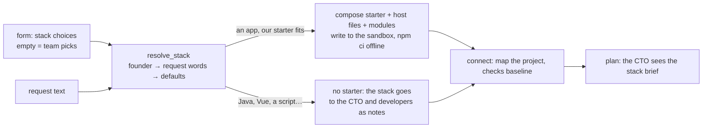

# Starters (starter repo and ready-made modules)

**Status:** Done (Phase 2): stack choice, Next.js and Python starters, four modules; tested live end to end (Oct 5, 2026)  
**Code:** `backend/app/features/starters/` · files in `backend/starters/` · workflow step `backend/app/features/workflows/nodes/scaffold.py` · `frontend/src/features/starters/` · migration `0008_run_stack`  
**Last updated:** 2026-10-05

## What it is

A new project no longer starts from an empty folder. The team starts from a **tested starter** and drops in **ready-made modules**: sign-in, payments, reminders and an admin dashboard. Developers then adapt working parts instead of writing them from scratch, and the free model has much less to get wrong.

**The founder decides the stack**, as freely as they like:
- **Their choices win:** frontend, API language, database, hosting and payment provider, in the form or in the request's own words ("a Python API on AWS with Stripe").
- **Empty fields are the team's call:** Next.js, Supabase, Vercel, Razorpay.
- **Unknown tools are followed too** (Java, Cashfree, MongoDB…): the team builds them from scratch, following the founder's notes, such as links to the docs.

## How it works

1. **Stack** (`stack.py`, no model call, so the same request always gets the same stack):

   | Part | Founder's form | Words in the request | Team's default |
   | --- | --- | --- | --- |
   | frontend | any name ("Next.js" counts as `nextjs`) | next.js/react, vue, angular, svelte, "api only" → none | `nextjs` |
   | api | any name | python/fastapi, django, flask, java/spring, express/nestjs, golang, rails, php/laravel, .net | `nextjs` (with a frontend), else `python` |
   | database | any name | supabase, postgres, mysql, mongodb, sqlite, firebase, dynamodb | `supabase` (Next.js), `sqlite` (Python), else `postgres` |
   | hosting | any name | vercel, docker/vps, digitalocean, aws/ec2/lightsail, gcp, azure, railway, render.com, fly.io, netlify, heroku | `vercel` (Next.js), else `docker` |
   | payments | any name, or `none` | razorpay, stripe, cashfree, paypal, phonepe, payu, paytm, instamojo | `razorpay` |

   `Stack.sources` records who decided each part (`founder`, `request`, `team`); the generated `AGENTS.md` shows it.

2. **Starter or not:**
   - The founder can say always or never.
   - Otherwise any stack choice in the form means "it's an app", and so does a request that sounds like one ("website", "dashboard", "login"; "app" or "api" unless it reads like a script, CLI or library). Repo runs never get a starter.
   - Which starter:

   | API + frontend | Starter | Layout |
   | --- | --- | --- |
   | nextjs + nextjs (or none) | `nextjs` | at the root, with modules |
   | python + none | `fastapi` | at the root |
   | python + nextjs | `fastapi` + `nextjs` | split: `api/` and `web/`; no modules (they exist for the Next.js API only; the team writes those parts) |
   | anything else | none | the team sets it up; the stack brief says so |

3. **Modules:**
   - The founder ticks them, or they're found from the request's words: `auth` ("login", "accounts", "members"…), `payments` ("pay", "checkout", "subscription", "fees"…), `reminders` ("remind", "notify", "schedule"…), `dashboards` ("admin", "dashboard", "reports"…).
   - Required modules come first (`dashboards` needs `auth`).
   - The `payments` module is dropped when payments are `none`, or with a provider we don't have (that provider goes into the brief as something to build).
4. **Compose** (`StarterService.compose`):
   - The files are layered in order: the starter's files, then the host's extra files (`hosting.toml`: Docker files for docker, digitalocean, aws, gcp, azure, railway, render, fly, vps), then each module's files. `vercel.json` (the reminders cron) is only included for Vercel.
   - `*.tmpl` files are filled in: `AGENTS.md` gets the stack table and each module's guide, `.env.example` gets each module's settings (`PAYMENTS_PROVIDER={{payments}}`), and `docker-compose.yml` gets the reminders cron service.
5. **The scaffold step** (`nodes/scaffold.py`, after `prepare`, before `connect`):
   - It only runs for new projects with a `stack_choice`, in an empty workspace (evals' seeded projects are left alone). It writes the files and runs the starter's setup: `npm ci --prefer-offline`, about 9 s from the image's npm cache, with no network needed.
   - It sets the test command (`npm test`, or both halves for split), and puts `stack` and `stack_brief` in the state. The CTO's plan prompt and every developer brief include the stack brief: "Read AGENTS.md first; build on these parts instead of rewriting them."
   - Then `connect` maps the project like an existing one, and QA measures its checks baseline (type-check, lint and build all pass on the starter).
   - On a retry after a crash, a workspace with our `AGENTS.md` is written and installed again.
6. **Activity:** `project.scaffolded` from `devops` (Neel): "Set up the project from our Next.js starter with sign-in, payments (nextjs + nextjs, supabase, vercel)", or "Chose the stack: nextjs + java, postgres, docker" when there's no starter.

### The Next.js starter (`backend/starters/nextjs/`)

- Next.js 16.3, React 19.3, TypeScript 5.9 strict, ESLint 9 (`eslint-config-next`), Vitest 3; exact versions in `package-lock.json`.
- Scripts: `test`, `typecheck`, `lint`, `build`, so QA's checks find all four.
- **Data layer** `lib/db`: `getStore().collection<T>(name)` with insert, get, find, findOne, update, remove and count.
  - **Local mode** with no keys: in memory, or `.data/store.json` in development, so tests and previews run anywhere.
  - **Postgres mode** when `DATABASE_URL` is set (Supabase's connection string works): one `documents` table with JSON data (`db/migrations/001_documents.sql`, RLS on).
  - Connections are encrypted with the certificate checked across the internet, and plain on private networks (hosts without a dot, private IPs) or when `?sslmode=` is in the URL.
- `output: "standalone"` for Docker; `/api/health`.

| Module | What it adds | Settings |
| --- | --- | --- |
| `auth` (Sign-in) | `lib/auth`: `currentUser()`, `requireUser()`. Local accounts (scrypt hashes, signed 30-day session cookie) or Supabase Auth when its keys are set. Pages /login, /signup, /account | `SESSION_SECRET`; `NEXT_PUBLIC_SUPABASE_URL`, `NEXT_PUBLIC_SUPABASE_ANON_KEY` |
| `payments` | `lib/payments`: `PaymentProvider` with Razorpay (orders API, payment and webhook signatures) and Stripe (Checkout session, signed webhooks with a 5-minute tolerance), picked by `PAYMENTS_PROVIDER`. Routes `/api/payments/order`, `/verify`, `/webhook`; a `payments` record per order, marked paid only after a signature check; `<PayButton>`; /pay | `RAZORPAY_*`, `STRIPE_*`, `NEXT_PUBLIC_SITE_URL` |
| `reminders` | `lib/reminders`: `scheduleReminder()`, `sendDueReminders()` (one failure doesn't stop the rest). `Notifier`: Resend email or the log. `GET /api/cron/reminders` (Bearer `CRON_SECRET`). Run daily by Vercel Cron (free plan) or every 5 minutes by docker-compose | `CRON_SECRET`, `RESEND_API_KEY`, `EMAIL_FROM` |
| `dashboards` (Admin dashboard) | /admin for `ADMIN_EMAILS`, otherwise 404: totals, 14-day bar chart (no chart library), latest records with secret-looking fields hidden | `ADMIN_EMAILS` |

**Docker hosting** (`hosting/docker`): a multi-stage `Dockerfile` (standalone server, non-root), `.dockerignore`, and `docker-compose.yml` with Postgres 17 that applies the migrations on first start.

### The Python starter (`backend/starters/fastapi/`)

FastAPI with `app/store.py`: the same collections idea on SQLite (`DATABASE_PATH`, in memory by default), CORS for the frontend, `/health`, pytest tests, a `Dockerfile`.

## Code map

| File | Responsibility |
| --- | --- |
| `starters/schemas.py` | `StackChoice` (the founder's input), `Stack` (resolved: `table()`, `brief()`), `StarterSpec`, `ModuleSpec`, `HostingSpec`, `ScaffoldResult` |
| `starters/stack.py` | `resolve_stack()`, `canonical()`, the word tables |
| `starters/interfaces.py` | `StarterCatalog` Protocol |
| `starters/catalog.py` | `FileCatalog`: reads `backend/starters/` |
| `starters/service.py` | `StarterService`: `resolve`, `compose`, `commands`, `scaffold` |
| `starters/router.py` | `GET /starters/options`, `POST /starters/preview` |
| `workflows/nodes/scaffold.py` | The step |
| `backend/starters/` | `nextjs/` (`starter.toml`, `files/`, `hosting.toml`, `hosting/docker/`), `fastapi/`, `modules/<name>/` (`module.toml`, `files/`) |
| `sandbox-image/starter-deps/nextjs/` | Copies of the starter's `package.json` and lockfile; the image fills its npm cache from them |
| `frontend/src/features/starters/` | `StackFields` (the form section on runs and projects), `parseStack` |

## API

| Method | Path | Purpose | Auth |
| --- | --- | --- | --- |
| GET | `/starters/options` | Suggested names per part and the modules (any other name is accepted) | none yet |
| POST | `/starters/preview` | `{request, stack}` → the `Stack` the team would use | none yet |

`POST /runs` and `POST /projects` take `stack` (`StackChoice`; ignored with a `repo`). `GET /runs/{id}` and projects return it.

## Data model

`runs.stack` and `projects.stack` (jsonb, migration 0008): the founder's `StackChoice`. The resolved stack and the scaffold result live in the run's checkpoint (`state.stack`, `state.scaffold`).

## Events

`project.scaffolded` (new type) from `devops`.

## Dependencies

- **Used by:** `workflows` (the step; `build_app_graph(..., starters=)`, wired in `app/workers/wiring.py`), `runs` and `projects` (`StackChoice`), `projects` planner (Mira hears the founder's stack)
- **Sandbox:** `medhkarm-sandbox:4` (Node 22 with npm, the starter's packages cached at `/opt/medhkarm/npm-cache`)
- **Config:** none; the catalog is the `backend/starters/` folder

## Design decisions

- 2026-10-05 — **The founder's stack wins, any name; empty means we pick** (Pavan): Next.js frontend, the API in whatever they ask for, database and hosting as they say, Razorpay unless they name another provider or bring docs for a new one.
- 2026-10-05 — **Words, not a model, decide the stack**: free, predictable, testable. The CTO still reads the request and can adapt.
- 2026-10-05 — **Local mode first.** Every module works with no keys (memory store, local accounts, log notifier, "payments aren't connected"), so the sandbox, QA's tests and previews run before the founder connects anything.
- 2026-10-05 — **One JSON `documents` table** for Postgres and Supabase: no migrations needed to start, and the same code everywhere. Real tables come with migrations when a collection needs joins.
- 2026-10-05 — **Payments through REST, not SDKs**: no extra packages, the same `PaymentProvider` for every provider, and signatures checked with Node's crypto.
- 2026-10-05 — **All module packages in the base `package.json`**: one lockfile, one cached install; modules only add files.
- 2026-10-05 — **Node 22 from the official image** in the sandbox: Debian's `nodejs` had no npm, so JavaScript projects couldn't install.

## How to run and test

- Backend: `uv run pytest app/features/starters app/features/workflows/tests/test_scaffold_step.py`, which covers the stack rules, composition from the real catalog, the image cache matching the starter, and the step in a run.
- The starter itself, as checked (Oct 5, 2026): compose with all modules, then in `medhkarm-sandbox:4` with `--network none`:
  - `npm ci --prefer-offline` installs 419 packages in 9 s
  - `npm test` passes 13 tests
  - `typecheck`, `lint` and `build` pass (12 routes)
  - Vikram's Semgrep rules are clean, and the secrets scan finds nothing
  - Against a throwaway `postgres:17-alpine`, the Postgres store passes its test: `TEST_DATABASE_URL=… npm test`.
- Python starter: `python -m pytest -q` passes 2 tests in the sandbox.
- After changing the starter's packages: update `package-lock.json` (`npm install` in a `node:22` container), copy both files to `sandbox-image/starter-deps/nextjs/`, bump the image tag.

## Known limitations and gotchas

- **First live run (Oct 5, 2026, gpt-oss:20b), failed at QA.** The cafe feedback wall: Neel set up the starter with sign-in and the admin dashboard; Kabir planned 5 tasks.
  - What went wrong: Isha wrote her own Supabase helper instead of using `lib/db`, imported it with a wrong `../../` path, and hit her step limit three times.
  - What worked: her tests passed, but QA's type-check, lint and build caught the broken import, and the fix round didn't solve it. The run stopped before the gate.
  - Fixed since: the starter's rules are now in every developer brief, and the developers' test command type-checks.
- **Second live run (Oct 5, 2026, same request and model): reached the gate.**
  - Kabir planned 3 tasks: the API to Isha, the home and admin pages to Arjun. Arjun reused the dashboard module (added `messages` to `ADMIN_COLLECTIONS`).
  - QA caught a lint error (`any`) and a build error (`"use client"` not first). Isha's fix round, after one send-back from Kabir, made tests, types, lint and build pass.
  - Tara's Playwright test passed on the Next.js app, Vikram found nothing, and Neel's Vercel preview was ready.
- Local mode on Vercel keeps data in each server instance's memory: on a preview, accounts and records can vanish between requests. Connect a database (`DATABASE_URL`) for anything real.
- Supabase Auth and real Razorpay/Stripe test-mode payments are covered by unit tests only, not tried against the services.
- Modules exist only for the Next.js API; a split (Python API + Next.js) project gets none, and QA's checks and Neel's preview look only at the project root (so neither half of a split project is checked or previewed).
- Neel deploys to Vercel only: Docker, DigitalOcean and AWS get the files but no automatic deploy.
- Vercel's free plan runs crons once a day, so reminders send daily there.
- SMS and WhatsApp reminders aren't built (email and log only).
- The image is now 3.24 GB.

## Troubleshooting

| Symptom | Likely cause | Fix |
| --- | --- | --- |
| "Installing the starter … failed" in the brief | The image's npm cache doesn't match the lockfile (packages changed) | Copy the starter's `package.json` and lockfile to `sandbox-image/starter-deps/nextjs/`, rebuild the image |
| A script got a starter (or an app didn't) | The request's words | Set "Starter: never / always" in the form |
| `The server does not support SSL connections` | A remote database without TLS | Add `?sslmode=disable` to `DATABASE_URL` |

## Changelog

| Date | Change |
| --- | --- |
| 2026-10-05 | A technology in the request counts only when asked for as the stack ("using Python", "with a Python API", "deploy it to AWS", "paid with Stripe"): a live landing-page spec listing the company's own tech ("Backend: Python, FastAPI… Docker") had picked the Python starter. Long specs (700+ characters) pick modules from the opening request only, not from the page copy |
| 2026-10-05 | After the first live run (cafe feedback wall, failed QA): the starter's rules go into every developer brief (`starter.toml` `rules`: use `getStore()` from `@/lib/db`, `@/` imports, no other database client); the developers' test command is `npm run typecheck && npm test` |
| 2026-10-05 | Created: stack choice (founder → request → defaults), Next.js and Python starters, modules auth/payments/reminders/dashboards, Docker hosting files, the `scaffold` step, `project.scaffolded`, `runs.stack`/`projects.stack`, sandbox image `medhkarm-sandbox:4` (Node 22, npm cache) |
