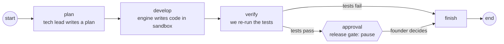

# Workflows

**Status:** Build graph done (Phase 0 stack check)  
**Code:** `backend/app/features/workflows/` · entry point `backend/app/workers/build_run.py`  
**Last updated:** 2026-10-01

## What it is

The sequence of steps a build goes through, run by LangGraph: plan → develop → verify → release gate → finish. Every step's result is saved in a Postgres checkpoint, so a run can pause for the founder's approval, the process can stop, and a different process can resume it later. This is the core of the "founder approves" promise.

## How it works



1. **plan** — the model writes a short numbered plan from the request.
2. **develop** — creates the run's sandbox (or re-attaches by id) and calls the `DeveloperEngine` with the request + plan.
3. **verify** — re-runs the test command in the same sandbox. QA never trusts the developer's report.
4. **approval** — only reached if tests pass. `interrupt()` saves the run and stops, returning the gate details (summary, files changed, test output). Resuming with `Command(resume={"approved": ..., "feedback": ...})` continues from here.
5. **finish** — destroys the sandbox and sets `status`: `released`, `rejected` or `failed`.

The run id is LangGraph's `thread_id`; each checkpoint is stored under it.

## Code map

| File | Responsibility |
| --- | --- |
| `state.py` | `BuildState`: everything a run knows (saved in each checkpoint) |
| `nodes/base.py` | `BuildNode` Protocol: the shape every node factory returns |
| `nodes/plan.py` | Planner node |
| `nodes/develop.py` | Developer node (creates / attaches the sandbox) |
| `nodes/verify.py` | QA node (re-runs tests) |
| `nodes/approval.py` | Release gate (`interrupt`) |
| `nodes/finish.py` | Outcome + sandbox cleanup |
| `graphs/build_app.py` | Wires the nodes and edges; takes its dependencies as arguments |
| `checkpointer.py` | Opens the Postgres checkpointer and creates its tables |
| `service.py` | `WorkflowService`: `start`, `resume`, `get`; reports each step through a callback |
| `schemas.py` | `StepUpdate`, `RunOutcome` |
| `app/workers/build_run.py` | Command-line entry point; the only place real implementations are chosen |

## API

No HTTP endpoints yet. Command line:

```bash
uv run python -m app.workers.build_run start --request "..." --test-command "..." [--engine builtin|openhands]
uv run python -m app.workers.build_run resume <run_id> --approve [--feedback "..."]
uv run python -m app.workers.build_run resume <run_id> --reject  [--feedback "..."]
uv run python -m app.workers.build_run status <run_id>
```

## Data model

LangGraph creates and owns its tables in our Postgres (`checkpoints`, `checkpoint_blobs`, `checkpoint_writes`, `checkpoint_migrations`) through `AsyncPostgresSaver.setup()`. They aren't managed by Alembic.

## Events

`on_step` receives a `StepUpdate` after each node. Today the CLI prints it; later it writes to the event log that drives the office view.

## Dependencies

- **Other features used:** `models`, `developer_engine`, `sandbox`, through their interfaces
- **External services:** Postgres (checkpoints), Docker and Ollama Cloud via the implementations wired in `build_run.py`. `build_engine()` there picks the developer engine and its matching sandbox from `DEVELOPER_ENGINE` (or `--engine`).
- **Libraries:** `langgraph`, `langgraph-checkpoint-postgres`, `psycopg` (checkpoints use psycopg 3; the app uses asyncpg)
- **Config:** `DATABASE_URL` (converted to a plain `postgresql://` URL by `Settings.psycopg_database_url`)

## Design decisions

- 2026-10-01 — Nodes are built by factory functions that receive their dependencies (`make_develop_node(engine, sandboxes)`), so the graph never creates concrete classes and tests run it with fakes.
- 2026-10-01 — Failed verification skips the gate: the founder is only asked to approve code whose tests pass.
- 2026-10-01 — The sandbox id lives in the state, so a resumed run in a new process re-attaches to the same workspace.
- 2026-10-01 — LangGraph + Postgres checkpoints instead of Temporal for the MVP (see [04-tech-stack.md](../../04-tech-stack.md)).

## How to run and test

- Unit tests (fakes, in-memory checkpoints): `uv run pytest app/features/workflows`
- Live stack check: start Postgres (`docker compose up -d`), set `OLLAMA_API_KEY`, then run `start`, and `resume` from a new terminal.

## Known limitations and gotchas

- Resume uses the current `DEVELOPER_ENGINE`. That's harmless today (after the gate only `finish` runs, and removing a container works with either provider), but a future graph that does more work after the gate should store the engine in the state.
- One fixed graph; per-template graphs (PM → CTO → Dev → QA → DevOps) come in Phase 1–2.
- No retry loop from verify back to develop yet.
- Runs are started from the command line; API endpoints and a worker queue come in Phase 1.

## Troubleshooting

| Symptom | Likely cause | Fix |
| --- | --- | --- |
| `connection refused` on start | Postgres not running | `docker compose up -d` |
| Resume says `SandboxNotFoundError` | Sandbox container was removed while paused | Start a new run |
| `status` shows nothing for a run id | Wrong id, or a different database | Check the id printed by `start` and `DATABASE_URL` |

## Changelog

| Date | Change |
| --- | --- |
| 2026-10-01 | `--engine` option; engine and sandbox chosen together in `build_engine()` |
| 2026-10-01 | Created: build graph with plan, develop, verify, release gate and finish; Postgres checkpoints; CLI |
