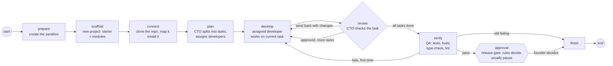

# Workflows

**Status:** Build graph with CTO planning and review (Phase 1)  
**Code:** `backend/app/features/workflows/` · run by the worker's build jobs (`backend/app/workers/handlers/build.py`, see [jobs.md](jobs.md)) or the command line (`backend/app/workers/build_run.py`)  
**Last updated:** 2026-10-04

## What it is

The sequence of steps a build goes through, run by LangGraph: the CTO plans tasks and assigns them to developers; for each task the developer works and the CTO reviews (sending it back with changes if needed); then QA verifies, the founder approves, and the run finishes. Every step's result is saved in a Postgres checkpoint, so a run can pause for the founder's approval, the process can stop, and a different process can resume it later. This is the core of the "founder approves" promise.

## How it works



0. **prepare** — creates the run's sandbox (unless one was given, as the eval runner does), so its id is saved in a checkpoint before any work. A retry or another worker then re-attaches to it instead of creating a new one.
0. **scaffold** — for a new project with stack choices: decides the stack (the founder's choices, then the request's words, then Next.js/Supabase/Vercel/Razorpay) and, for an app, writes our starter and its modules into the workspace and installs them offline; sets the test command and `stack_brief`, which the CTO's plan and every developer brief include ([starters.md](starters.md)). Repo runs and non-empty workspaces are left alone.
0. **connect** — gets to know the project before anyone plans: clones the founder's repository if the run has one, maps the code (files, languages, outline, how to install and test) and installs it, and fills in the test command if none was given ([repos.md](repos.md)). Then it runs QA's quality checks once on the project as found (`checks_baseline`, see verify). For a new project with an empty workspace it does nothing.
1. **plan** — the CTO (with the codebase map, for an existing project) (template role `cto`: model and `instructions`) answers with the `submit_plan` tool: a summary, how many developers to use, and 1–5 tasks in order. `assign()` gives each task an id (`t1`…) and an owner, round-robin over the developers' names (up to the developer role's `max_count`). The plan is read leniently (see `cto.py`): small models name fields their own way, and if no usable plan comes back the fallback is one task covering the whole request.
2. **develop** — re-attaches to the run's sandbox by id; the current task's owner works on it through the `DeveloperEngine`. The brief has the request, the CTO's plan, "your task (i of n)", and, on a second attempt, the CTO's requested changes. Tasks run one after another in the same workspace, so later tasks build on earlier ones.
3. **review** — if the task's files include a stand-in for the test tool (e.g. `pytest.py`, see `guards.py`), or its tests failed, it goes straight back to the developer (no model call). Otherwise the CTO reads the task, the developer's summary and the changed files (up to 6, 1,500 characters each) and answers with `submit_review`: approve, or revise with specific changes. A task gets at most `max_revisions` (default 1) rounds of changes; after that the run moves on (`done_with_issues`) and QA's final check decides. A review the CTO doesn't format properly counts as approval, so a format slip never blocks a run.
3. **verify** — asks the run's `WorkChecker` whether the work is good. QA never trusts the developer's report. For software that's `QualityChecker` around `TestCommandChecker`:
   - **Tests:** re-runs the test command in the same sandbox; fails at once if the workspace contains a stand-in for the test tool.
   - **Quality checks**, found from the workspace at check time (`checkers/quality.py`), so a new project is checked by whatever its developers set up:

     | Check | When | Command |
     | --- | --- | --- |
     | `syntax` | The run changed Python files | Parses each changed `.py` file (no bytecode written) |
     | `types` | `package.json` has a `typecheck`/`type-check`/`check-types`/`tsc` script, or a `tsconfig.json` with `typescript` installed | `npm run typecheck`, or `npx --no-install tsc --noEmit` |
     | `lint` | `package.json` has a `lint` script | `npm run lint` |
     | `build` | `package.json` has a `build` script | `npm run build` |
     | `ruff` | `[tool.ruff]` in `pyproject.toml`, or `ruff.toml` | `ruff check .` |
     | `mypy` | `[tool.mypy]` in `pyproject.toml`, or `mypy.ini` | `mypy .` |

     npm, pnpm or yarn follows the lockfile; Node checks install dependencies first if `node_modules` is missing. Every check runs even after one fails, so a fix sees all the problems at once (10-minute limit each).
   - **What blocks:** failing tests, or a check that fails now but passed (or didn't exist) before the team started. A check that **already failed** on the project as found (`checks_baseline`) is noted ("already failing before this work: mypy") and doesn't block: the founder's old problems aren't this run's to fix. A tool that isn't installed (exit 127) is skipped.
   - **One fix round** (closes gap G-04): on a failure (failing checks, or tests asked for but none written) a task **"Make QA's checks pass"** (`qa1`) goes to the first developer with the failing output and commands ("never delete, skip or weaken tests or checks"). It goes through develop → CTO review → verify again. Still failing → the run fails without asking the founder. A run that changed no files fails without a fix round.
   - `state.checks` holds each check (`CheckRun`: name, command, passed, skipped, already_failing, output).

   Human review (content team) and approval rules (operations team) will be other checkers.
4. **approval** — only reached if tests pass. The team's approval rules look at the run's facts (files changed, tokens, open review comments; see [approvals.md](approvals.md)) and either decide on their own (approve or reject, recorded as `approval.decided` by `system`) or pause: `interrupt()` saves the run and stops, returning the gate details (why it asks, summary, files changed, tokens, test output). Resuming with `Command(resume={"approved": ..., "feedback": ...})` continues from here.
5. **finish** — on a released new-project run with `new_repo`, creates a private repository and pushes the work to `main`; on a released repo run, commits the work to `medhkarm/<run_id>`, pushes it and opens a pull request (before the sandbox goes, so a failed push is retried with the work still there); then destroys the sandbox and sets `status`: `released`, `rejected` or `failed`.

The run id is LangGraph's `thread_id`; each checkpoint is stored under it.

**After an interruption** (a worker died or was stopped mid-run), `WorkflowService.continue_run()` carries on from the last checkpoint: the interrupted step starts again from its beginning, in the same sandbox, and a `run.resumed` event is recorded. `RunOutcome.next_nodes` says whether a run stopped part-way (steps left, no gate) — the worker's build handlers use it to decide between start, continue and resume.

### QA's browser test (Tara)

After the tests pass, runs that changed something a user sees in a browser (`.html`, `.htm`, `.jsx`, `.tsx`, `.vue`, `.svelte`, or files under `templates/`, `static/`, `public/`, `pages/`, `components/`) get an **end-to-end browser test** (`nodes/browser_qa.py`):

1. Tara (the QA role: its own `instructions`, `tools`, `max_steps`; the built-in engine with `actor: qa`) writes **one** test in `tests/e2e/` with pytest-playwright: start the app as it really runs, use the page like a person (fill in, click, check what appears), stop the server. If she finds the app itself broken, she says so ("APP BUG: …").
2. We run the test ourselves (`python -m pytest tests/e2e -q -p no:cacheprovider`); her word is never taken.
3. Passed → on to the security step; the gate shows `browser_test: passed: tests/e2e/…`. The test ships with the code.
4. Failed (or an app bug) → **one** task "Make the browser test pass" for the frontend specialist (`ui1`: fix the app, not the test; never weaken it), then review, QA's tests, and the **same** browser test again. Still failing → the run fails without asking the founder.

Events: `work.started` and `tool.used` from Tara (`actor: qa`, `member: Tara`), `check.finished` ("Browser test passed (…)", "Browser test failed: sent to Arjun to fix", "Stopped the release: the browser test still fails"), `task.assigned` for the fix task.

Live test (Oct 4, 2026): a BMI calculator (FastAPI + a page). Kabir split it into 4 tasks for the backend and frontend specialists, QA's tests passed, and Tara read `app.py` and `static/index.html` and wrote `tests/e2e/test_bmi_e2e.py`. Her test starts uvicorn, enters 70 kg and 170 cm, clicks Calculate, and checks for "BMI: 24.2 (normal)". It passed in headless Chromium; Vikram found nothing, and the run reached the gate (about 1.4 lakh tokens).

## Code map

| File | Responsibility |
| --- | --- |
| `state.py` | `BuildState`: everything a run knows (saved in each checkpoint) |
| `interfaces.py` | `WorkChecker` Protocol: `check(state, sandbox) -> CheckResult` |
| `checkers/test_command.py` | `TestCommandChecker`: runs the test command |
| `checkers/quality.py` | `QualityChecker` (tests, then the quality checks), `detect_checks()`, `run_checks()`, `measure_baseline()` |
| `nodes/base.py` | `BuildNode` Protocol: the shape every node factory returns |
| `cto.py` | The CTO's plan and review as data: `submit_plan` / `submit_review` tools, lenient parsing, `assign()` |
| `nodes/prepare.py` | First node: creates the sandbox |
| `nodes/scaffold.py` | New projects: stack, starter and modules ([starters.md](starters.md)) |
| `nodes/connect.py` | Clones and maps the project (`RepoService`), sets the test command if empty |
| `nodes/plan.py` | CTO planning node |
| `nodes/review.py` | CTO review node and `after_review` routing |
| `nodes/develop.py` | Developer node: current task, sandbox, totals across tasks |
| `nodes/verify.py` | QA node: the checker, the fix task (`qa1`), `after_verify` routing |
| `nodes/approval.py` | Release gate: `approval_facts()`, approval rules, `interrupt` |
| `guards.py` | `shadowed_test_tools()`: spots work that fakes its tests (a stand-in `pytest.py`); `asks_for_tests()` / `is_test_file()`: tests asked for but none written |
| `nodes/finish.py` | Outcome, pull request for released repo runs, sandbox cleanup |
| `graphs/build_app.py` | Wires the nodes and edges; takes its dependencies as arguments |
| `checkpointer.py` | Opens the Postgres checkpointer and creates its tables |
| `service.py` | `WorkflowService`: `start`, `resume`, `continue_run`, `get`; reports each step through a callback |
| `schemas.py` | `QualityCheck`, `CheckRun`, `CheckResult`, `StepUpdate`, `RunOutcome` |
| `activity.py` | `record_step()`: what each step means in the activity log |
| `app/workers/build_run.py` | Command-line entry point |
| `app/workers/wiring.py` | `build_engine()`: picks the developer engine and sandbox from settings; `workflow_service()`: the Postgres-backed service used by `build_run` and the worker |

## API

Runs start and get approved over HTTP through the runs feature ([runs.md](runs.md)), which queues jobs for the worker ([jobs.md](jobs.md)). The command line still works, for quick local runs:

```bash
uv run python -m app.workers.build_run start --request "..." --test-command "..." [--engine builtin|openhands]
uv run python -m app.workers.build_run resume <run_id> --approve [--feedback "..."]
uv run python -m app.workers.build_run resume <run_id> --reject  [--feedback "..."]
uv run python -m app.workers.build_run status <run_id>
```

## Data model

LangGraph creates and owns its tables in our Postgres (`checkpoints`, `checkpoint_blobs`, `checkpoint_writes`, `checkpoint_migrations`) through `AsyncPostgresSaver.setup()`. They aren't managed by Alembic.

## Events

`on_step` receives a `StepUpdate` after each node. Today the CLI prints it; later it writes to the event log that drives the office view.

## Dependencies

- **Other features used:** `models`, `developer_engine`, `sandbox`, through their interfaces
- **External services:** Postgres (checkpoints), Docker and Ollama Cloud via the implementations wired in `build_run.py`. `build_engine()` there picks the developer engine and its matching sandbox from `DEVELOPER_ENGINE` (or `--engine`).
- **Libraries:** `langgraph`, `langgraph-checkpoint-postgres`, `psycopg` (checkpoints use psycopg 3; the app uses asyncpg)
- **Config:** `DATABASE_URL` (converted to a plain `postgresql://` URL by `Settings.psycopg_database_url`)

## Design decisions

- 2026-10-01 — CTO plans and reviews (Phase 1). Tasks run sequentially in one workspace: parallel developers on separate branches would need merging, which isn't worth it for small tasks yet. The office still shows each task's owner.
- 2026-10-01 — Structured output through tool calls (`submit_plan`, `submit_review`), parsed leniently: gpt-oss:20b called the tool every time but used its own field names (`name` for `title`, extra `files`/`tests` keys) in 3 of 3 tries; strict parsing rejected every plan.
- 2026-10-01 — Failing tests are sent back without asking the model; reviews are capped at one round of changes per task to bound cost.
- 2026-10-01 — Every step is recorded in the activity log ([events.md](events.md)): `WorkflowService` takes an optional `EventStore` and records start, plan, work, check, approvals and finish; the develop node records `work.started` and passes a `RunRecorder` to the engine. `run_id` is stored in the state so nodes can record against it.
- 2026-10-04 — **QA checks the project's own build, type-check and lint, only what it configures.** No imposed linters or style: a founder's project is judged by its own rules, and a new project by what its developers set up. Checks already failing before the run only make a note, like the security engineer's "changed files only".
- 2026-10-04 — **One QA fix round**, the same pattern as security and browser tests: many runs failed for one fixable test error; one round caps the cost.
- 2026-10-01 — The checking step is an interface (`WorkChecker`), so each kind of team can check work its own way. `build_app_graph(..., checker=...)` defaults to `TestCommandChecker`.
- 2026-10-01 — `WorkflowService.start(..., sandbox_id=...)` can run in an existing, prepared sandbox (used by the eval runner to seed a starting project).
- 2026-10-01 — Nodes are built by factory functions that receive their dependencies (`make_develop_node(engine, sandboxes)`), so the graph never creates concrete classes and tests run it with fakes.
- 2026-10-01 — Failed verification skips the gate: the founder is only asked to approve code whose tests pass.
- 2026-10-01 — The sandbox id lives in the state, so a resumed run in a new process re-attaches to the same workspace.
- 2026-10-01 — LangGraph + Postgres checkpoints instead of Temporal for the MVP (see [04-tech-stack.md](../../04-tech-stack.md)).

## How to run and test

- Unit tests (fakes, in-memory checkpoints): `uv run pytest app/features/workflows`
- Live stack check: start Postgres (`docker compose up -d`), set `OLLAMA_API_KEY`, then run `start`, and `resume` from a new terminal.

## Known limitations and gotchas

- Resume uses the current `DEVELOPER_ENGINE`. That's harmless today (after the gate only `finish` runs, and removing a container works with either provider), but a future graph that does more work after the gate should store the engine in the state.
- **Cost grows with tasks.** A 3-part request (expense tracker: add/list, monthly totals, CSV export) became 4 tasks for 3 developers, with one send-back: about 384,000 tokens and 7 minutes on gpt-oss:20b, against about 10,000 for a one-task build. Developers re-read the project and run tests per task, and the CTO reviews each one. Fine on free models; important for pricing.
- The eval suite's results predate the CTO step; rerun it before comparing.
- One fixed graph; per-template graphs (PM → CTO → Dev → QA → DevOps) come in Phase 1–2.
- `ruff` and `mypy` aren't in the sandbox image: they run when the project's own dependencies install them, and are skipped otherwise (a new project that adds `[tool.ruff]` without installing ruff isn't linted).
- Checks already failing before the run are recorded in the activity log, not shown at the release gate.
- The QA fix task goes to the first developer, whatever failed (a frontend lint error isn't routed to the frontend specialist).
- Not yet tried live on a Node/Next.js project (Phase 2 end test pass).
- Faked tests: in a sandbox without pytest, gpt-oss:20b wrote its own `pytest.py` so the test command "passed", and the CTO approved it (seen twice live on Oct 1). Now the sandbox has pytest by default, the developer and CTO instructions forbid it, and the review and QA refuse it automatically (`guards.py`). Other ways of faking (tests that assert nothing) still rely on the CTO's review.

## Troubleshooting

| Symptom | Likely cause | Fix |
| --- | --- | --- |
| `connection refused` on start | Postgres not running | `docker compose up -d` |
| Resume says `SandboxNotFoundError` | Sandbox container was removed while paused | Start a new run |
| `status` shows nothing for a run id | Wrong id, or a different database | Check the id printed by `start` and `DATABASE_URL` |

## Changelog

| Date | Change |
| --- | --- |
| 2026-10-05 | A task titled like page work (UI, page, form, screen, component…) and not API work is tagged `frontend`, whatever the CTO's plan says (a live plan gave "Add UI for submitting feedback" to the backend developer) |
| 2026-10-05 | `hollow_tests()` in `guards.py`: test files that define tests but check nothing (`assert True`, `expect(true).toBe(true)`, no assertion) are sent back by the review without a model call, and QA fails them (then the usual fix round) |
| 2026-10-05 | `scaffold` step after `prepare` (starter and modules for new projects, `stack`, `stack_brief`, `scaffold` in the state; `WorkflowService.start(..., stack=)`); the stack brief goes into the plan and developer briefs; Tara's brief says how to start a Next.js app |
| 2026-10-04 | QA checks: `QualityChecker` runs the tests plus the project's build, type-check and lint (`syntax`, `types`, `lint`, `build`, `ruff`, `mypy`); `checks_baseline` measured in `connect` so old failures don't block; one fix round (`qa1`, "Make QA's checks pass", `qa_rounds`); `state.checks`; `after_verify` |
| 2026-10-04 | `preview` step (DevOps) after security; production deploy in `finish` after approval |
| 2026-10-04 | `browser_qa` step: QA writes an end-to-end Playwright test for web changes; one fix round for the frontend developer; `finish` fails runs whose browser test still fails |
| 2026-10-04 | Specialties: the CTO tags tasks (`specialty`), `assign()` prefers matching specialists, the develop node adds the specialty's instructions |
| 2026-10-04 | `security` step after verify: the security engineer's scans, one fix task for blocking findings (`sec1`), warnings to the gate; `finish` fails runs whose security problems remain |
| 2026-10-01 | A request that asks for tests ("add tests", "with pytest tests") needs a test file added or changed: the review sends the last task back (no model call) and QA fails the run otherwise (`guards.py`: `asks_for_tests`, `is_test_file`). A live run on itsdangerous reached the gate with the feature but no tests |
| 2026-10-01 | Work that changes no files is sent back by the review (no model call), and QA fails a run that changed nothing: on an existing project the old tests pass untouched, and a live run reached the gate with no changes |
| 2026-10-01 | `connect` node (clone, map, install) between `prepare` and `plan`; the CTO and developers get the codebase map; `finish` opens a pull request for released repo runs; `build_app_graph(..., repos=...)`, `start(..., repo=...)`, `build_run start --repo/--branch` ([repos.md](repos.md)) |
| 2026-10-01 | Approval rules at the release gate (`approval_policy`, facts, reasons in the gate); review and QA refuse stand-ins for the test tool; CTO tokens totalled (`cto_tokens_total`) |
| 2026-10-01 | `prepare` node creates the sandbox first (retries no longer leak containers); `continue_run()` and `RunOutcome.next_nodes` for runs interrupted mid-way; runs normally start through the job queue |
| 2026-10-01 | CTO agent: plans tasks, assigns developers by name, reviews each task and sends it back with changes; CTO tokens recorded |
| 2026-10-01 | Planner takes its instructions from the team template (`planner_instructions`) |
| 2026-10-01 | Activity log: steps and approvals recorded as events |
| 2026-10-01 | `WorkChecker` interface and `TestCommandChecker`; `start()` accepts a prepared sandbox; wiring moved to `app/workers/wiring.py` |
| 2026-10-01 | `--engine` option; engine and sandbox chosen together in `build_engine()` |
| 2026-10-01 | Created: build graph with plan, develop, verify, release gate and finish; Postgres checkpoints; CLI |
