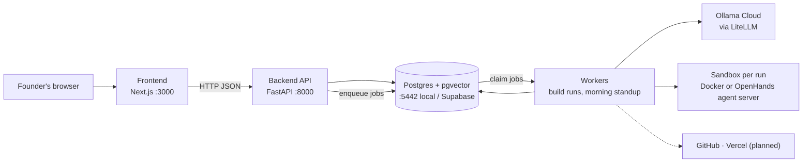
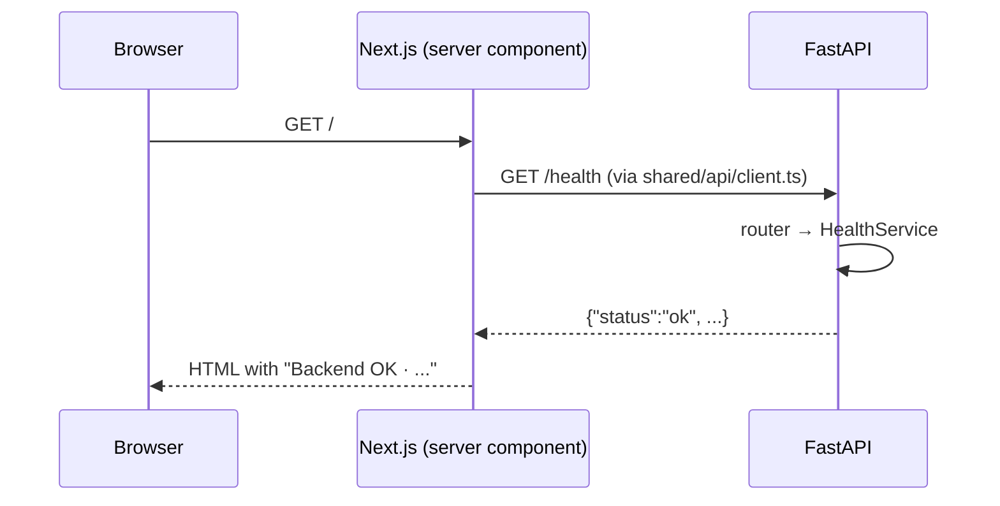

# System overview

**Last updated:** 2026-10-01

How the pieces of MedhKarm fit together. This describes what exists today; planned parts are marked *(planned)*.

## Components

Solid lines exist today; dotted lines are planned. The API never does long work: `POST /runs` writes a run and a job to Postgres and returns, and workers (`uv run python -m app.workers.main`) claim the job and run the build ([jobs.md](features/jobs.md), [runs.md](features/runs.md)). The command line (`app/workers/build_run.py`) still works for quick local runs.

| Component | Where | Status | Role |
| --- | --- | --- | --- |
| Frontend | `frontend/` | Running | UI. Server components call the API through `src/shared/api/client.ts`. Admin page at `/admin`: start, watch and approve runs, live activity, standup |
| Backend API | `backend/app/` | Running | HTTP API; one router per feature, assembled in `app/main.py` |
| Workers | `backend/app/workers/` | Running | `main.py` claims jobs from the Postgres job queue: build start/resume, the morning standup. Also command-line tools (`build_run`, `run_evals`, `standup`) |
| Runs and jobs | `backend/app/features/runs/`, `backend/app/features/jobs/` | Running | Start and approve runs over HTTP; durable job queue with leases and retries |
| Build workflow | `backend/app/features/workflows/` | Running | LangGraph graph: prepare → plan → (develop → review)* → verify → release gate → finish, checkpointed in Postgres |
| Standups | `backend/app/features/standups/` | Running | Daily standup from the activity log; sent each morning by the worker |
| Approval rules | `backend/app/features/approvals/` | Running | The team template's rules decide the release gate: ask the founder (default), approve or reject, with reasons |
| Models | `backend/app/features/models/` | Running | LiteLLM; default `gpt-oss:20b` on Ollama Cloud |
| Sandbox | `backend/app/features/sandbox/` | Running (Docker) | One isolated container per build run (`medhkarm-sandbox:dev`: Python, Node, pytest), or an OpenHands agent server |
| Developer engine | `backend/app/features/developer_engine/` | Running | Built-in tool loop or OpenHands, chosen by `DEVELOPER_ENGINE` |
| Team templates | `backend/app/features/teams/` | Running | Teams as settings files; the software team's CTO and developer are built from it |
| Activity log | `backend/app/features/events/` | Running | Append-only `events` table; every step, tool use and model call; API with live stream |
| Postgres | `docker-compose.yml` locally, Supabase in production | Running locally | All data, LangGraph checkpoints, the activity log, runs, the job queue, embeddings (pgvector) |
| Redis | `docker-compose.yml` | Running locally, unused yet | Caching later (the job queue is in Postgres) |

## How a request flows today

Every future feature follows the same path: route file → feature component → feature `api/` → shared client → backend feature router → service → repository → database.

## Code structure

Both sides are organised by feature, with the same feature names on each side. Full rules: [05-architecture-and-conventions.md](../05-architecture-and-conventions.md).

- **Backend layers** (checked by `import-linter`): `app.main` / `app.workers` → `app.features` → `app.shared` → `app.core`. Lower layers never import higher ones.
- **Frontend boundaries** (checked by ESLint): code imports a feature only via `@/features/<name>`; `src/shared/` never imports features.

## Configuration

| Side | File | Key settings |
| --- | --- | --- |
| Backend | `backend/.env` (from `.env.example`), read by `app/core/config.py` | `DATABASE_URL`, `REDIS_URL`, `CORS_ORIGINS`, `ENVIRONMENT`, `DEFAULT_MODEL`, `OLLAMA_API_BASE`, `OLLAMA_API_KEY`, `SANDBOX_IMAGE`, `TEAM_TEMPLATE`, `DEVELOPER_ENGINE`, `BUILTIN_MAX_STEPS`, `OPENHANDS_SERVER_IMAGE`, `OPENHANDS_MAX_ITERATIONS`, `EVAL_SANDBOX_IMAGE`, `STANDUP_*`, `WORKER_CONCURRENCY`, `WORKER_POLL_SECONDS`, `JOB_LEASE_SECONDS`, `JOB_RETRY_SECONDS`, `BUILD_MAX_ATTEMPTS` |
| Frontend | `frontend/.env.local` (from `.env.example`) | `NEXT_PUBLIC_API_URL` |

## Features

See the index in [README.md](README.md).
