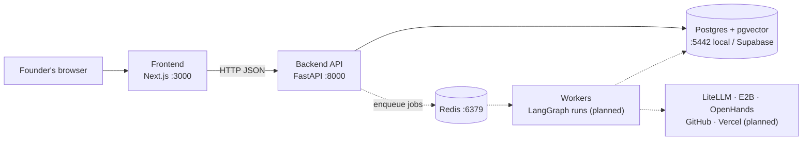
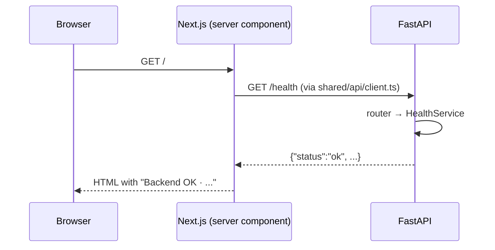

# System overview

**Last updated:** 2026-10-01

How the pieces of MedhKarm fit together. This describes what exists today; planned parts are marked *(planned)*.

## Components

| Component | Where | Status | Role |
| --- | --- | --- | --- |
| Frontend | `frontend/` | Running | UI. Server components call the API through `src/shared/api/client.ts` |
| Backend API | `backend/app/` | Running | HTTP API; one router per feature, assembled in `app/main.py` |
| Workers | `backend/app/workers/` | Entry point only | Long-running work (agent runs, sandboxes, evals); queue chosen in Phase 1 |
| Postgres | `docker-compose.yml` locally, Supabase in production | Running locally | All data, LangGraph checkpoints, embeddings (pgvector) |
| Redis | `docker-compose.yml` | Running locally, unused yet | Job queue and caching |

## How a request flows today

Every future feature follows the same path: route file → feature component → feature `api/` → shared client → backend feature router → service → repository → database.

## Code structure

Both sides are organised by feature, with the same feature names on each side. Full rules: [05-architecture-and-conventions.md](../05-architecture-and-conventions.md).

- **Backend layers** (checked by `import-linter`): `app.main` / `app.workers` → `app.features` → `app.shared` → `app.core`. Lower layers never import higher ones.
- **Frontend boundaries** (checked by ESLint): code imports a feature only via `@/features/<name>`; `src/shared/` never imports features.

## Configuration

| Side | File | Key settings |
| --- | --- | --- |
| Backend | `backend/.env` (from `.env.example`), read by `app/core/config.py` | `DATABASE_URL`, `REDIS_URL`, `CORS_ORIGINS`, `ENVIRONMENT` |
| Frontend | `frontend/.env.local` (from `.env.example`) | `NEXT_PUBLIC_API_URL` |

## Features

See the index in [README.md](README.md).
